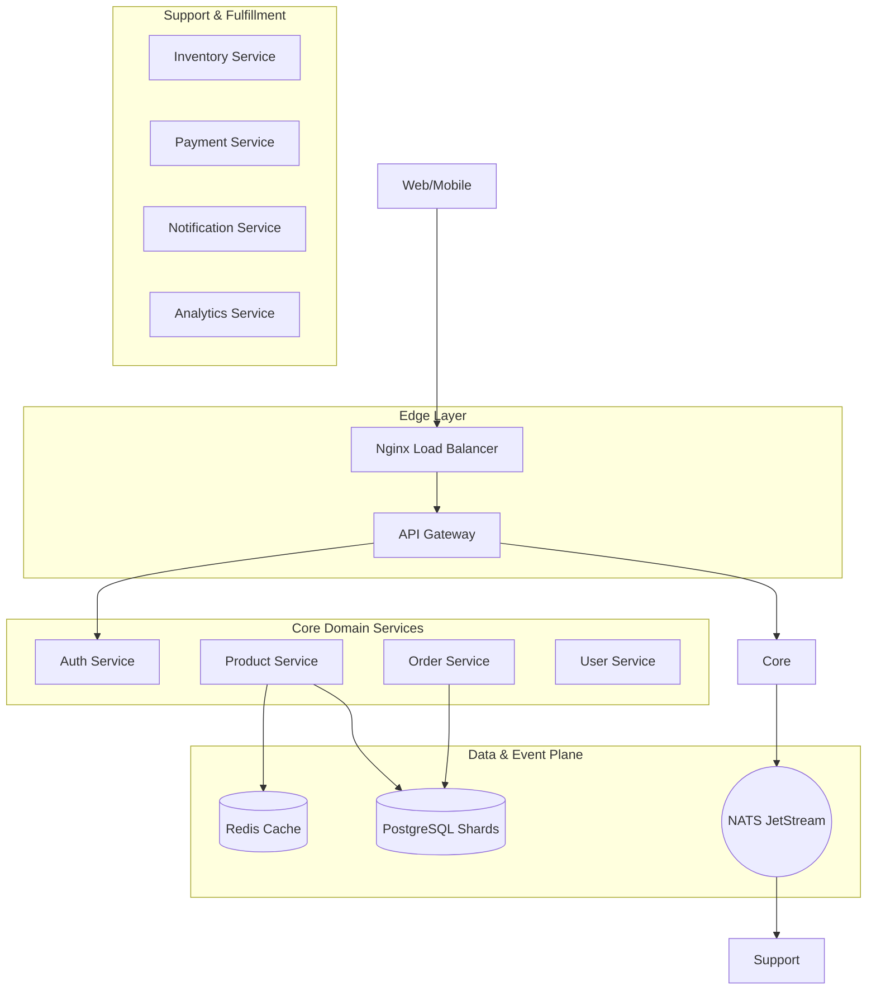

<div align="center">
  
  <h1>🚀 Skyline Shop: Production-Grade Microservices</h1>
  <p><b>An elite-level, high-scale distributed systems reference architecture.</b></p>
  <p><i>The definitive blueprint for microservices with NestJS, gRPC, and NATS JetStream.</i></p>

[](https://nestjs.com/)
[](https://www.postgresql.org/)
[](https://nats.io/)
[](https://redis.io/)
[](https://www.docker.com/)

---

[](http://makeapullrequest.com)
[](http://www.firsttimersonly.com/)
[](https://hacktoberfest.com/)
[](CODE_OF_CONDUCT.md)

</div>


---

> **Keywords:** Microservices, Distributed Systems, NestJS architecture, gRPC, NATS JetStream, Event-Driven Architecture, PostgreSQL Sharding, Redis Caching, Saga Pattern, CQRS, Scalable E-commerce.

---

## 🔭 Project Vision

This platform is an elite-level implementation of a modern e-commerce backend, designed for **high availability**, **massive scalability**, and **zero-trust security**. It serves as a blueprint for Staff+ engineers to demonstrate distributed systems patterns used at companies like Stripe, Uber, and Netflix.

> **📈 Scale Target:** Designed to serve **10M+ registered users**, **1M+ products**, and **tens of thousands of concurrent sessions** with sub-second p99 latency — via application-level PostgreSQL sharding, a 3-node Elasticsearch cluster, NATS JetStream event bus, Redis caching, and ClickHouse analytics.

### 🎯 What You'll Learn

- **Distributed Systems**: Service discovery, load balancing, and gRPC orchestration.
- **Data Scaling**: Multi-node database sharding and read-replica strategies.
- **Event-Driven Design**: Asynchronous choreography using NATS JetStream.
- **Resiliency Engineering**: Circuit breakers, exponential backoff, and dead-letter queues.
- **Security Architecture**: PGP payload signing, bcrypt password hashing, and RBAC.

---

## 🗺️ Documentation Portal

| Layer                 | Focus                      | Links                                                                                                                                                                                                                                                                                    |
| :-------------------- | :------------------------- | :--------------------------------------------------------------------------------------------------------------------------------------------------------------------------------------------------------------------------------------------------------------------------------------- |
| **🏗️ Architecture**   | System design & principles | [Deep Dive](./docs/architecture/system-design-deep-dive.md) • [Overview](./docs/architecture/system-overview.md) • [Algorithms](./docs/architecture/algorithms.md) • [Database Architecture](./docs/architecture/database-architecture.md) • [Discovery & Ranking](./docs/architecture/discovery-and-ranking.md) |
| **🛡️ Reliability**    | Scaling & Resiliency       | [Scaling & Sharding](./docs/infrastructure/scaling-and-sharding.md) • [Resiliency Patterns](./docs/architecture/resiliency-patterns.md) • [Testing](./docs/architecture/testing-strategy.md)                                                                                             |
| **🔐 Security**       | Protection & Identity      | [Security Architecture](./docs/architecture/security-architecture.md) • [Checkout Flow](./docs/flows/checkout-flow.md) • [Security Policy](./SECURITY.md)                                                                                                                                |
| **🧩 Services**       | Domain Implementation      | [API Gateway](./apps/api-gateway/README.md) • [Order Service](./apps/order-service/README.md) • [Full Catalog](./docs/services/README.md)                                                                                                                                                |
| **📈 Observability**  | Metrics & Monitoring       | [Monitoring Strategy](./docs/infrastructure/observability.md) • [Glossary](./docs/GLOSSARY.md)                                                                                                                                                                                           |
| **🛠️ Infrastructure** | Tooling & DevOps           | [Getting Started](./docs/infrastructure/getting-started.md) • [Docker Setup](./docs/infrastructure/docker-setup.md) • [AWS & Floci](./docs/infrastructure/aws-and-floci.md) • [Nginx Proxy](./docs/infrastructure/nginx.md) • [Roadmap](./docs/ROADMAP.md)                                    |

---

## 🏗️ System Reference Architecture



---

## 🖼️ UI Showcase

A modern storefront experience powered by the microservices backend — built with **React 19**, **TypeScript**, **Tailwind CSS**, **Zustand**, and **React Query**.

| | |
| :--- | :--- |
| **🏠 Home / Banner & Navbar** | **🛍️ Catalog (All Products)** |
|  |  |
| **📦 Product Details** | **⭐ Product Reviews** |
|  |  |
| **🛒 Cart** | **📦 Order Details / Tracking** |
|  |  |

> Full end-to-end flows: [Browsing & Catalog](./docs/flows/catalog-browsing-flow.md) • [Checkout](./docs/flows/checkout-flow.md) • [Order Tracking](./docs/flows/track-order-flow.md)

---

## 🛸 Engineering Roadmap

Propel your skills through our context-driven learning trajectory:

1.  **[🌑 Phase 1: Foundations](./docs/learning-path/beginner.md)**: Monorepo patterns, Domain Isolation, and NestJS Modules.
2.  **[🚀 Phase 2: Distributed Systems](./docs/learning-path/intermediate.md)**: gRPC, NATS Pub/Sub, and API Gateway orchestration.
3.  **[🌌 Phase 3: High Scale & Resilience](./docs/learning-path/advanced.md)**: CQRS, Database Sharding, and Circuit Breakers.
4.  **[🔭 Phase 4: Platform Engineering](./docs/learning-path/engineering-roadmap.md)**: Infrastructure as Code, Monitoring, and Zero-Trust Security.

---

## 🛠️ Technology Matrix

| Category          | Technology           | Decision Rationale                                                  |
| :---------------- | :------------------- | :------------------------------------------------------------------ |
| **Runtime**       | NestJS (Node.js 24)  | Enterprise-grade modularity and dependency injection.               |
| **Frontend**      | React 19 + Vite      | Fast, type-safe storefront with TanStack Query + Zustand.           |
| **Database**      | PostgreSQL + Prisma  | Strong consistency with type-safe, performance-optimized queries.   |
| **Sharding**      | Application-level PG | Horizontal partitioning of product (×4) & order (×4) shards + replicas. |
| **Search**        | Elasticsearch (×3)   | Real-time product search, filters, and recommendations.            |
| **Messaging**     | NATS JetStream       | Ultra-low latency, persistent event-store for asynchronous flows.   |
| **In-Memory**     | Redis                | Sub-millisecond data access for carts, sessions, and rate-limiting. |
| **RPC**           | gRPC (Protobuf)      | High-speed binary protocol for synchronous internal communication.  |
| **Analytics**     | ClickHouse           | Columnar OLAP sink for behavior events and sales reporting.         |
| **Observability** | Prometheus / Grafana | Real-time telemetry, plus Jaeger (traces) & OpenTelemetry.          |
| **Infrastructure**| Docker Compose       | 63-container stack: nginx LB, NATS cluster, pgBouncer, ESM.         |

---

## 📈 Scale & Performance Targets

| Dimension                | Target                                   | How It's Achieved                                                      |
| :----------------------- | :--------------------------------------- | :--------------------------------------------------------------------- |
| **Registered users**     | **10M+**                                 | Stateless services, JWT sessions, sharded identity stores.             |
| **Product catalog**      | **1M+ SKUs**                             | 4-way PostgreSQL sharding + Elasticsearch indexing.                    |
| **Concurrent sessions**  | **10k+**                                 | Horizontal service scaling behind nginx + Redis session cache.         |
| **Order throughput**     | Thousands of orders / min                | NATS JetStream buffering + Saga orchestration with idempotency.        |
| **Search latency**       | < 100 ms p99                            | 3-node Elasticsearch cluster with ranked queries & caching.            |
| **Checkout consistency** | Exactly-once                             | Idempotency keys, outbox pattern, and saga compensation.               |

---

## ⚡ Production-Grade Features

- ✅ **Database Sharding**: Key-based horizontal partitioning for massive product catalogs.
- ✅ **Idempotency**: Guaranteed single execution for sensitive operations (Payments/Orders).
- ✅ **Distributed Caching**: Multi-level caching strategy (Redis + In-memory).
- ✅ **Event Sourcing (Lite)**: Persistent event streams in NATS for analytics and auditing.
- ✅ **Zero-Trust Security**: PGP signed payloads for internal service-to-service communication.

---

## 🚀 Rapid Onboarding

> Full guide — including seed scripts, service URLs, local-dev hot reload, **AWS deployment and Floci local-AWS testing**, and troubleshooting — in [Getting Started](./docs/infrastructure/getting-started.md).

### 1. Prerequisites

- **Docker** & **Docker Compose** (v2 plugin) — required
- **git** — required
- **Node.js** v24+ / **pnpm** v9+ — optional (only for local dev; the docker images build their own toolchain)

### 2. Automated Bootstrap

```bash
chmod +x setup.sh
./setup.sh
```

The installer is interactive and adapts to your machine:

- picks a **mode**: `test` (run everything locally) or `prod` (deploy to AWS EKS / Floci)
- picks a **size**:
  | profile | what you get | containers |
  |---------|-------------|-----------|
  | `lite`  | no shards, replicas, ES, or monitoring — for low-end devices | ~14 |
  | `mid`   | shards + replicas, single-node Elasticsearch + Kibana, pgAdmin/RedisInsight, nginx LB | ~38 |
  | `full`  | everything, identical to `docker compose up -d` | 63 |
  | `custom`| pick shard counts, replicas, ES, observability, GUIs, NATS nodes, seed size | any |
- checks and auto-starts Docker, warns about missing tools, and creates `.env` from `.env.example`
- the resolved stack is written to `.setup/docker-compose.yml` (remembered in `.setup/active`) and
  replacing a stack with a different profile tears the previous one down first

Useful flags:

```bash
./setup.sh --dry-run    # resolve + validate the config without starting anything
./setup.sh --volumes    # also wipe named volumes when switching stacks
./setup.sh --help
```

Direct equivalents once you know what you want:

```bash
docker compose up -d                     # the full 63-container stack
PROFILE=lite ./scripts/compose-gen.sh > .setup/docker-compose.yml   # then compose -f .setup/... up -d
```

---

## 📜 Architectural Decisions (ADR)

We document the **WHY** behind every major architectural choice to maintain engineering context.

- [001: Microservices vs Monolith](./docs/adr/001-microservices-architecture.md)
- [002: Scaling and Sharding](./docs/adr/002-scaling-and-sharding.md)
- [Explore All ADRs](./docs/adr/README.md)

---

## 📄 Repository Standards

- **[CONTRIBUTING.md](./CONTRIBUTING.md)**: Engineering standards and PR workflow.
- **[SECURITY.md](./SECURITY.md)**: Security policy and vulnerability reporting.
- **[CODEOWNERS](./CODEOWNERS)**: Service ownership and review hierarchy.

---

---

## 🤝 Community & Contribution

We believe in the power of open source! This project is a living laboratory for distributed systems engineering.

- **Found a bug?** Open an [Issue](https://github.com/RajdeepDevelopment/skyline-shop-commerceos-microservices/issues).
- **Want to learn?** Read our [Engineering Wiki](./docs/PROJECT_WIKI.md) and [ADRs](./docs/adr/).
- **Ready to code?** Check out our [Contributing Guide](./CONTRIBUTING.md) and look for `good-first-issue` labels.

### ✨ Special Thanks to Contributors

_Join us and get your name on the list!_

---

<div align="center">
  MIT License • 2026 Production-Grade Engineering Hub • <a href="./CODE_OF_CONDUCT.md">Code of Conduct</a>
</div>
