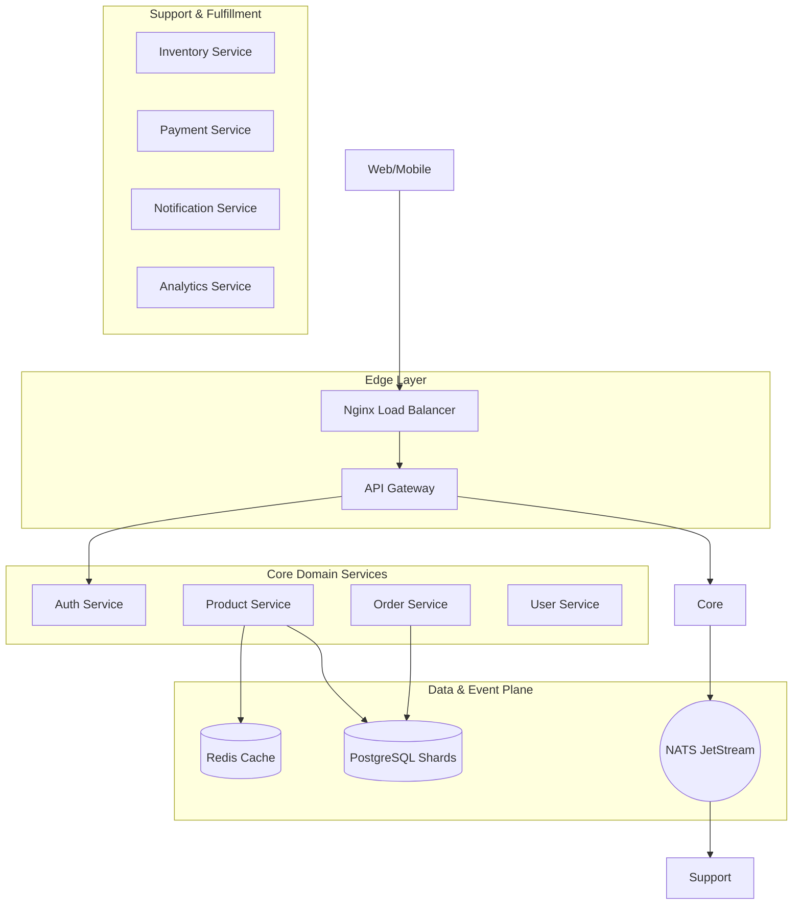

<div align="center">
  
  <h1>🚀 E-Commerce Microservices Platform</h1>
  <p><b>A production-grade, high-scale distributed systems reference architecture.</b></p>

[](https://nestjs.com/)
[](https://www.postgresql.org/)
[](https://nats.io/)
[](https://redis.io/)
[](https://www.docker.com/)

</div>

---

## 🔭 Project Vision

This platform is an elite-level implementation of a modern e-commerce backend, designed for **high availability**, **massive scalability**, and **zero-trust security**. It serves as a blueprint for Staff+ engineers to demonstrate distributed systems patterns used at companies like Stripe, Uber, and Netflix.

### 🎯 What You'll Learn

- **Distributed Systems**: Service discovery, load balancing, and gRPC orchestration.
- **Data Scaling**: Multi-node database sharding and read-replica strategies.
- **Event-Driven Design**: Asynchronous choreography using NATS JetStream.
- **Resiliency Engineering**: Circuit breakers, exponential backoff, and dead-letter queues.
- **Security Architecture**: PGP payload signing, Argon2 hashing, and RBAC.

---

## 🗺️ Documentation Portal

| Layer                     | Focus                      | Links                                                                                                                                                                                            |
| :------------------------ | :------------------------- | :----------------------------------------------------------------------------------------------------------------------------------------------------------------------------------------------- |
| **🏗️ Architecture**    | System design & principles | [Deep Dive](./docs/architecture/system-design-deep-dive.md) • [Overview](./docs/architecture/system-overview.md) • [CQRS](./docs/architecture/cqrs-pattern.md)                               |
| **🛡️ Reliability**    | Scaling & Resiliency       | [Scaling & Sharding](./docs/infrastructure/scaling-and-sharding.md) • [Resiliency Patterns](./docs/architecture/resiliency-patterns.md) • [Testing](./docs/architecture/testing-strategy.md) |
| **🔐 Security**          | Protection & Identity      | [Security Architecture](./docs/architecture/security-architecture.md) • [Auth Flow](./docs/flows/authentication-flow.md) • [Security Policy](./SECURITY.md)                                  |
| **🧩 Services**         | Domain Implementation      | [API Gateway](./apps/api-gateway/README.md) • [Order Service](./apps/order-service/README.md) • [Full Catalog](./docs/services/README.md)                                                    |
| **📈 Observability**    | Metrics & Monitoring       | [Monitoring Strategy](./docs/infrastructure/observability.md) • [Glossary](./GLOSSARY.md)                                                                                                      |
| **🛠️ Infrastructure** | Tooling & DevOps           | [Docker Setup](./docs/infrastructure/docker-setup.md) • [Nginx Proxy](./docs/infrastructure/nginx.md) • [Roadmap](./ROADMAP.md)                                                              |

---

## 🏗️ System Reference Architecture



---

## 🛸 Engineering Roadmap

Propel your skills through our context-driven learning trajectory:

1.  **[🌑 Phase 1: Foundations](./docs/learning-path/beginner.md)**: Monorepo patterns, Domain Isolation, and NestJS Modules.
2.  **[🚀 Phase 2: Distributed Systems](./docs/learning-path/intermediate.md)**: gRPC, NATS Pub/Sub, and API Gateway orchestration.
3.  **[🌌 Phase 3: High Scale & Resilience](./docs/learning-path/advanced.md)**: CQRS, Database Sharding, and Circuit Breakers.
4.  **[🔭 Phase 4: Platform Engineering](./docs/learning-path/engineering-roadmap.md)**: Infrastructure as Code, Monitoring, and Zero-Trust Security.

---

## 🛠️ Technology Matrix

| Category          | Technology           | Decision Rationale                                                  |
| :---------------- | :------------------- | :------------------------------------------------------------------ |
| **Runtime**       | NestJS (Node.js)     | Enterprise-grade modularity and dependency injection.               |
| **Database**      | PostgreSQL + Prisma  | Strong consistency with type-safe, performance-optimized queries.   |
| **Messaging**     | NATS JetStream       | Ultra-low latency, persistent event-store for asynchronous flows.   |
| **In-Memory**     | Redis                | sub-millisecond data access for carts, sessions, and rate-limiting. |
| **RPC**           | gRPC                 | High-speed binary protocol for synchronous internal communication.  |
| **Observability** | Prometheus / Grafana | Real-time telemetry and health visualization.                       |

---

## âš¡ Production-Grade Features

- ✅ **Database Sharding**: Key-based horizontal partitioning for massive product catalogs.
- ✅ **Idempotency**: Guaranteed single execution for sensitive operations (Payments/Orders).
- ✅ **Distributed Caching**: Multi-level caching strategy (Redis + In-memory).
- ✅ **Event Sourcing (Lite)**: Persistent event streams in NATS for analytics and auditing.
- ✅ **Zero-Trust Security**: PGP signed payloads for internal service-to-service communication.

---

## 🚀 Rapid Onboarding

### 1. Prerequisites

- **Node.js** v24+ • **pnpm** v9+
- **Docker** & **Docker Compose**

### 2. Automated Bootstrap

```bash
chmod +x setup.sh
./setup.sh
```

---

## 📜 Architectural Decisions (ADR)

We document the **WHY** behind every major architectural choice to maintain engineering context.

- [001: Microservices vs Monolith](./docs/adr/001-microservices-architecture.md)
- [002: Scaling and Sharding](./docs/adr/002-scaling-and-sharding.md)
- [Explore All ADRs](./docs/adr/README.md)

---

## 📄 Repository Standards

- **[CONTRIBUTING.md](./CONTRIBUTING.md)**: Engineering standards and PR workflow.
- **[SECURITY.md](./SECURITY.md)**: Security policy and vulnerability reporting.
- **[CODEOWNERS](./CODEOWNERS)**: Service ownership and review hierarchy.

---

<div align="center">
  MIT License • 2026 Production-Grade Engineering Hub
</div>
