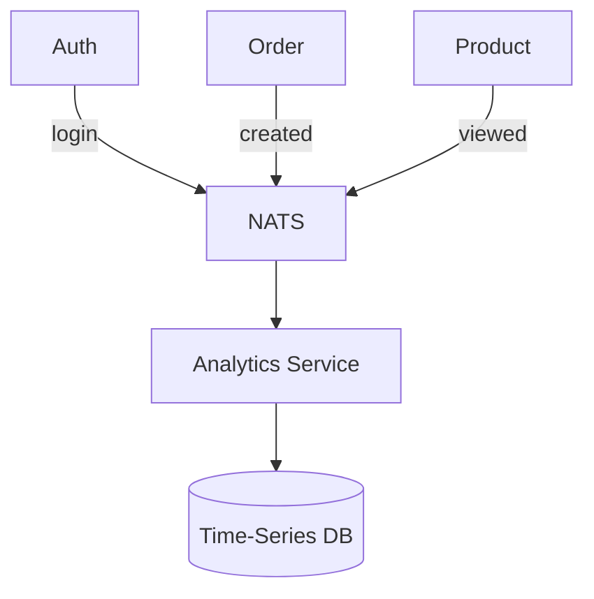

# 📊 Analytics Service

## 📝 Overview

Consumes system-wide events to provide business intelligence and tracking.

## 🗺️ System Design & Logic

- **Event Sourcing**: Reconstructs state from historical events.
- **Big Data Ready**: Designed to pipe events into data warehouses.

## 🔗 Inner Documentation

- **[Architecture](./../../docs/architecture/README.md)** - Event aggregation and processing.

## 🔄 Core Flow: Event Collection

---

[⬅️ Back to Platform Services](../../docs/services/README.md)
