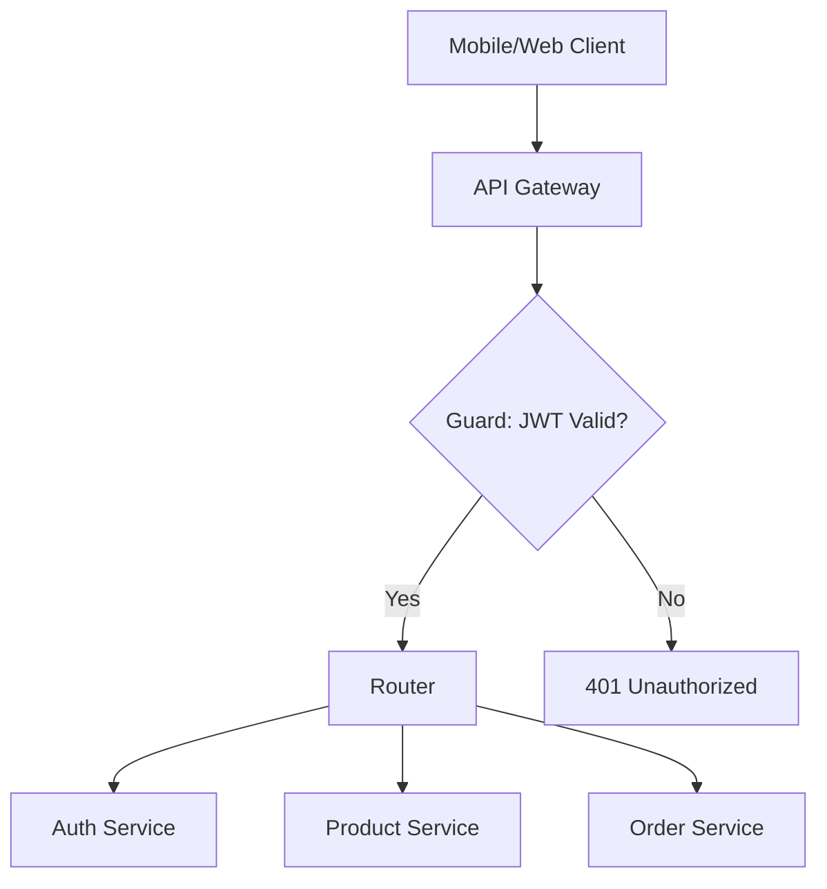

# 🚪 API Gateway

## 📝 Overview

The API Gateway is the single entry point for all client requests. It acts as a reverse proxy, routing requests to appropriate downstream microservices.

## 🗺️ System Design & Logic

- **Reverse Proxy**: Built on NestJS, routing traffic based on path prefixes (e.g., `/auth/*`, `/products/*`).
- **Cross-Cutting Concerns**: Handles Authentication, Rate Limiting, and Request Logging centrally.
- **Aggregation**: Orchestrates calls to multiple services for complex frontend views.

## 🔗 Inner Documentation

- **[Architecture & Routing](./docs/architecture.md)** - Gateway patterns and routing tables.
- **[Security & Rate Limiting](./docs/security.md)** - Protection strategies.

## 🔄 Core Flow: Request Routing

---

[⬅️ Back to Platform Services](../../docs/services/README.md)
