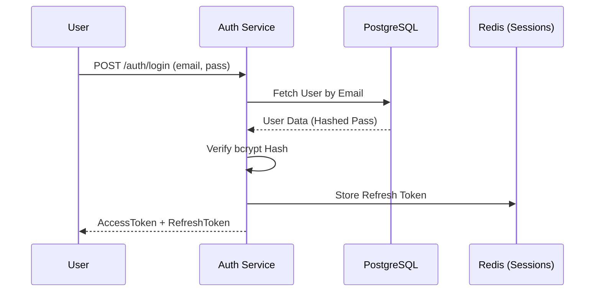

# 🔐 Auth Service

## 📝 Overview

The Auth Service is the security anchor of the platform, managing Identity, JWT issuance, and RBAC (Role-Based Access Control).

## 🗺️ System Design & Logic

- **Identity**: Centralized user credentials store.
- **Security**: Implements bcrypt for hashing and asymmetric PGP for sensitive payload signing.
- **Tokens**: Issues short-lived Access Tokens (JWT) and long-lived Refresh Tokens.

## 🔗 Inner Documentation

- **[Architecture & Flow](./../../docs/architecture/README.md)** - Auth sequences and PGP logic.
- **[Database Design](./../../docs/architecture/database-architecture.md)** - User schemas and session tracking.

## 🔄 Core Flow: Login & Token Issuance

---

[⬅️ Back to Platform Services](../../docs/services/README.md)
