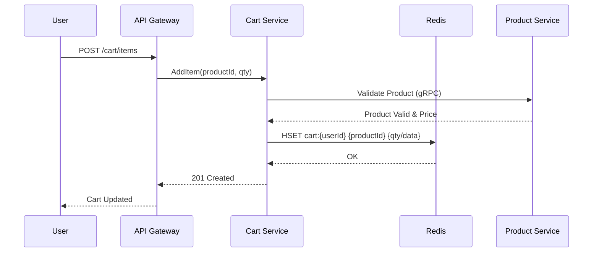

# 🛒 Cart Service

## 📝 Overview

The Cart Service manages transient user shopping sessions. It is designed for high-speed read/writes using Redis as the primary data store, ensuring low latency during the most active part of the user journey.

## 🗺️ System Design & Logic

- **Storage Strategy**: Uses Redis for ephemeral data (cart items) with a TTL (Time-To-Live) to automatically clear abandoned carts.
- **Consistency**: Final cart state is validated against the **Product Service** and **Inventory Service** during the checkout transition.
- **Concurrency**: Implements optimistic locking or atomic Redis operations to handle rapid item additions/removals.

## 🔗 Inner Documentation

- **[Architecture & Flow](./docs/architecture.md)** - Logic and Sequence Diagrams.
- **[Database Design](./docs/database-design.md)** - Redis schema and key structures.
- **[API Contracts](./docs/api-contracts.md)** - Request/Response schemas.

## 🔄 Core Flow: Add to Cart

---

[⬅️ Back to Platform Services](../../docs/services/README.md)
