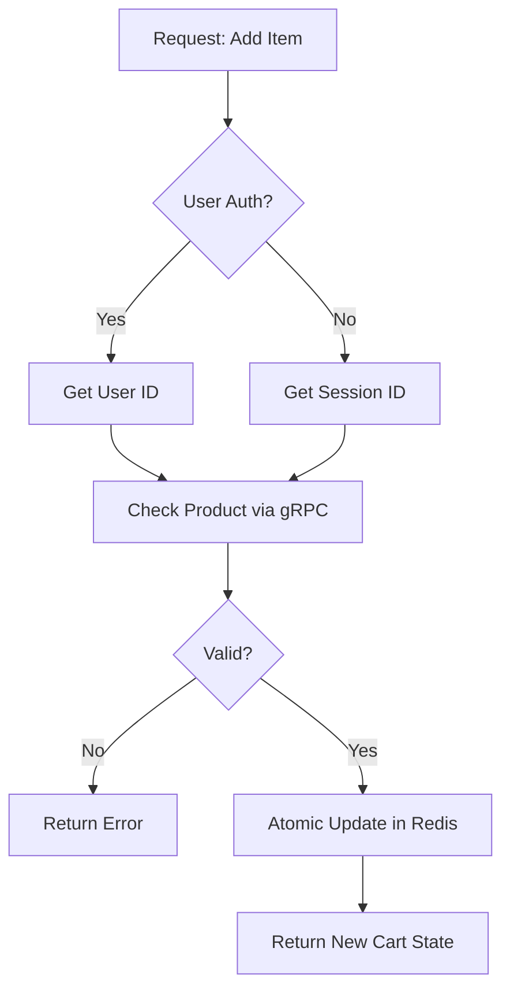

# Cart Service: Architecture & Flows

## 🏗️ Internal Logic

The service follows a modular NestJS structure. The `CartService` acts as the domain orchestrator, communicating with a `RedisRepository` for persistence.

### Use Cases

1. **Sync Cart**: Merging guest carts with authenticated user carts.
2. **Persistence**: Managing TTL for cart expiry (default 7 days).
3. **Price Calculation**: Real-time totaling of items (logic resides in service to avoid stale prices).

## 🌊 Detailed Item Addition Flow

## 🛡️ Resiliency

- **Circuit Breaker**: If Product Service is down, cart allows adding items but marks them as "Price Unverified".
- **Retry Logic**: Exponential backoff for Redis connection issues.
