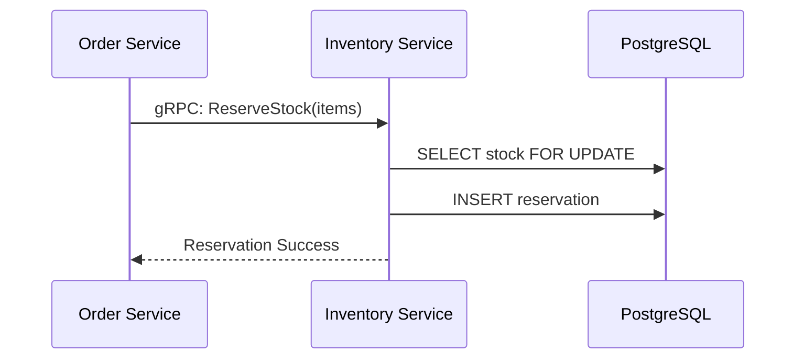

# 🏗️ Inventory Service

## 📝 Overview

Tracks real-time stock levels and handles high-concurrency reservations.

## 🗺️ System Design & Logic

- **Atomic Reservations**: Uses database transactions to ensure stock doesn't go negative.
- **Synchronous gRPC**: Provides low-latency stock checks for the Order Service.

## 🔗 Inner Documentation

- **[Architecture & gRPC](./../../docs/architecture/README.md)** - Internal communication.
- **[Database Design](./../../docs/architecture/database-architecture.md)** - Stock and Reservation schemas.

## 🔄 Core Flow: Stock Reservation

---

[⬅️ Back to Platform Services](../../docs/services/README.md)
