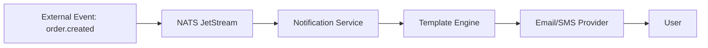

# 🔔 Notification Service

## 📝 Overview

Event-driven service that handles all outgoing communication (Email, SMS, Push).

## 🗺️ System Design & Logic

- **Provider Agnostic**: Easily switch between SendGrid, Twilio, etc.
- **Template Engine**: Manages dynamic content for notifications.

## 🔗 Inner Documentation

- **[Architecture & Flow](./docs/architecture.md)** - Event consumers and templates.

## 🔄 Core Flow: Event-Driven Notification

---

[⬅️ Back to Platform Services](../../docs/services/README.md)
