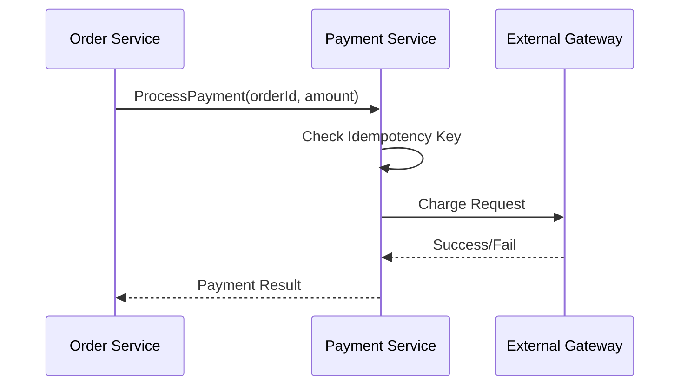

# 💳 Payment Service

## 📝 Overview

Handles financial transactions and integrates with external payment gateways.

## 🗺️ System Design & Logic

- **Idempotency**: Ensures that the same transaction isn't processed twice.
- **Security**: Never stores full card details; uses tokenization.

## 🔗 Inner Documentation

- **[Architecture & Security](./../../docs/architecture/README.md)** - Idempotency and Gateway integration.
- **[Database Design](./../../docs/architecture/database-architecture.md)** - Transaction logs.

## 🔄 Core Flow: Payment Processing

---

[⬅️ Back to Platform Services](../../docs/services/README.md)
