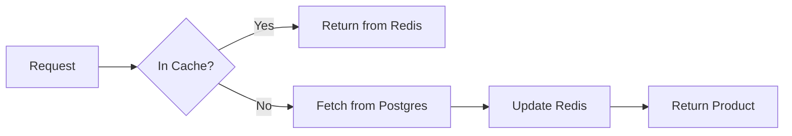

# 📦 Product Service

## 📝 Overview

The Product Service manages the catalog, categories, and real-time search capabilities.

## 🗺️ System Design & Logic

- **Read-Heavy**: Optimized for high-frequency reads using a Read-Through caching strategy with Redis.
- **Search**: Implements full-text search capabilities.
- **Consistency**: Uses event-driven updates to notify Inventory Service of new products.

## 🔗 Inner Documentation

- **[Architecture & Flow](./docs/architecture.md)** - Catalog management and caching.
- **[Database Design](./docs/database-design.md)** - Product/Category schemas.

## 🔄 Core Flow: Product Retrieval (Cache Aside)

---

[⬅️ Back to Platform Services](../../docs/services/README.md)
