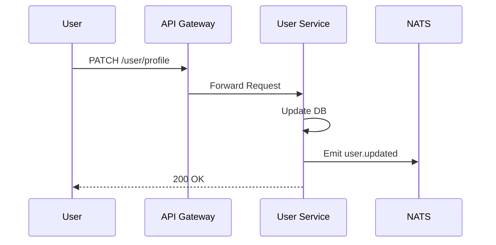

# 👤 User Service

## 📝 Overview

Manages user profiles, preferences, and account metadata.

## 🗺️ System Design & Logic

- **Profile Management**: CRUD operations for user data.
- **Event Consistency**: Emits `user.updated` events to keep other services (like Analytics) in sync.

## 🔗 Inner Documentation

- **[Architecture](./../../docs/architecture/README.md)** - Service design and events.
- **[Database Design](./../../docs/architecture/database-architecture.md)** - User schema.

## 🔄 Core Flow: Profile Update

---

[⬅️ Back to Platform Services](../../docs/services/README.md)
