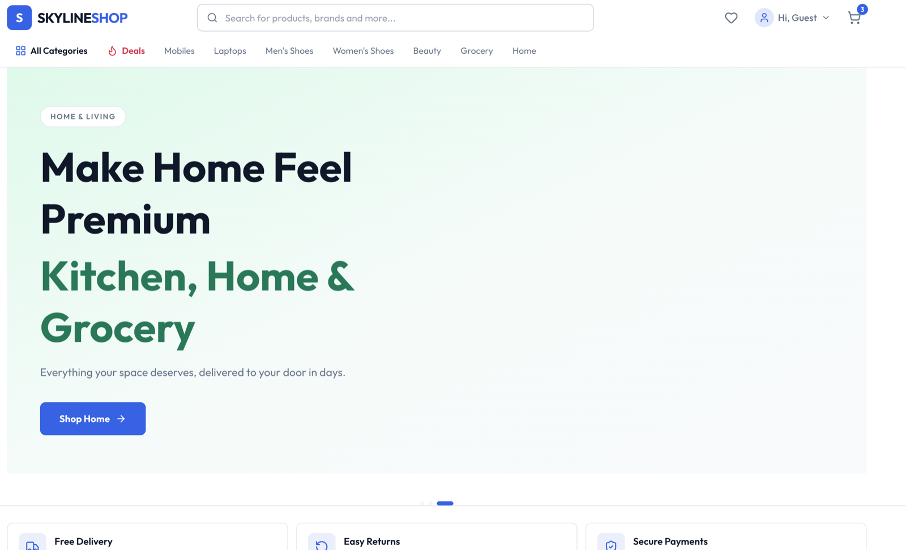
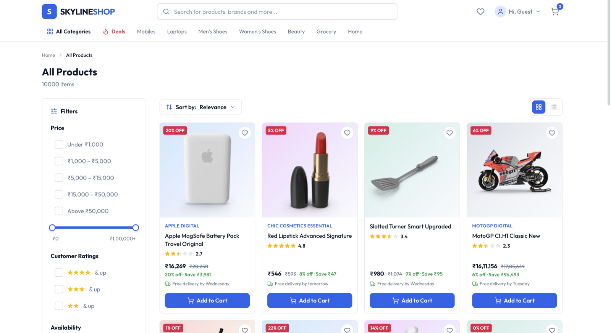
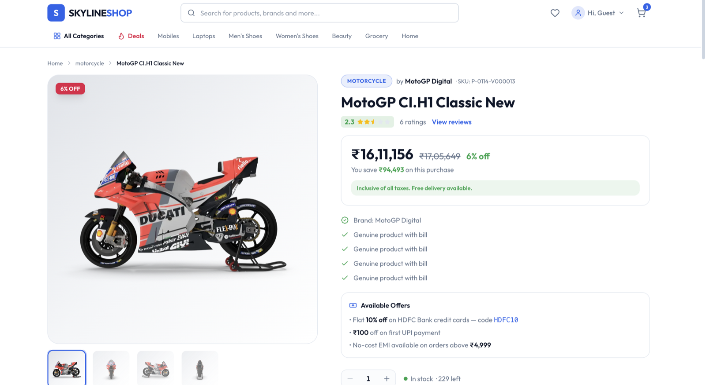
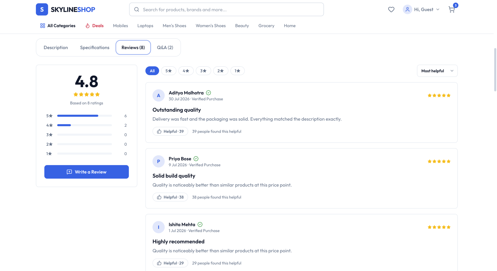
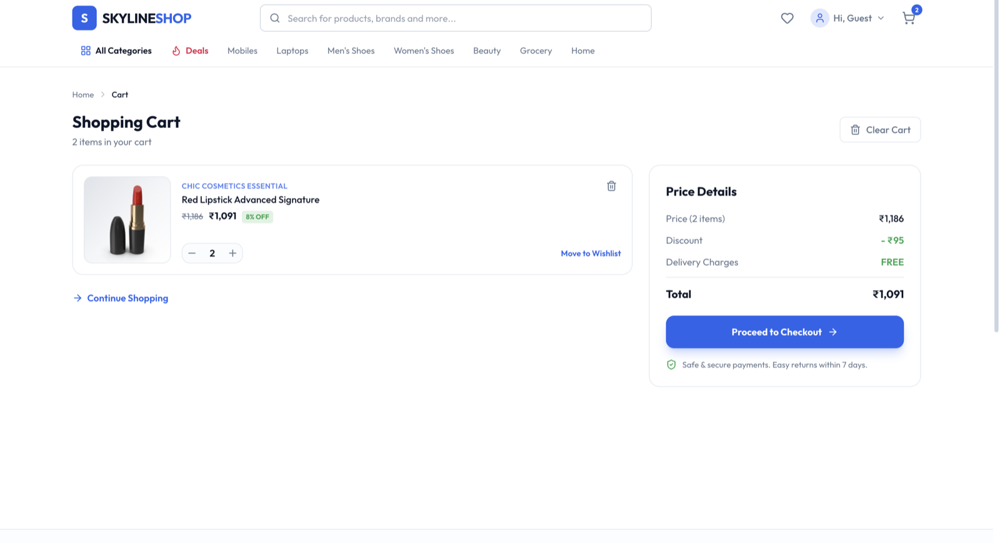
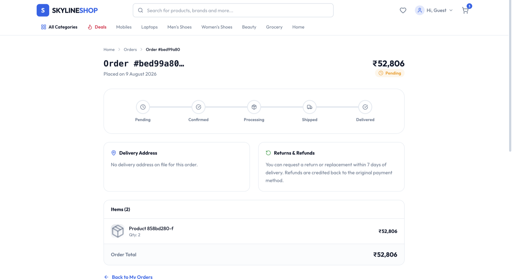

# 🛍️ E-Commerce Web Shop Frontend

A modern, modular e-commerce storefront built with **React 19**, **TypeScript**, **Vite**, **Tailwind CSS**, **TanStack Query**, and **Zustand**. It talks to the [microservices backend](../../docs/services/README.md) exclusively through the **API Gateway** (`/api/v1/*`).

## 🖼️ Screenshots

| | |
| :--- | :--- |
| **🏠 Home / Banner & Navbar** | **🛍️ All Products** |
|  |  |
| **📦 Product Details** | **⭐ Product Reviews** |
|  |  |
| **🛒 Cart** | **📦 Order Details / Tracking** |
|  |  |

## Architecture

Modular architecture with clear separation of concerns. Each module follows the same shape:

```
modules/[module-name]/
├── components/     # Module-specific React components
├── services/       # API service layer for backend communication
├── stores/         # Zustand state management
├── types/          # TypeScript type definitions
└── hooks/          # Custom React hooks
```

### Common Components

Reusable UI components live in `common/ui/` and `components/ui/`:

- Button, Input, Card, Dialog, Loading components
- Consistent design system with Tailwind CSS + CVA
- TypeScript support with proper prop interfaces

### State & Data

- **Zustand** for global state (auth, cart, orders, recently-viewed)
- **TanStack Query** for server-state caching and invalidation
- **React Hook Form + Zod** for validated forms (checkout, address, review)
- Guest identity (`x-anonymous-id`) + session id sent on every request so the backend can track behaviour (recently viewed, recommendations) even when logged out

## Modules

### Auth Module
- Login / Register / Logout (httpOnly JWT cookies)
- Session persistence + protected routes

### Catalog & Products
- Product listing with category + **price-range filters (INR)** and sorting
- Product details, similar items, frequently-bought, recently-viewed
- Search suggestions, trending/popular searches
- Reviews + rating summaries

### Cart Module
- Add / remove / update cart items, live totals
- Local storage persistence + server sync via Cart Service

### Orders Module
- Checkout (idempotent create-order)
- **Order tracking** — clean 404 "Order not found" for missing ids
- Order history on the Account page

### Account Module
- Profile summary, **order history**, **addresses**, **saved payment cards**, recently-viewed products
- Sign-out

## API Integration

Every call goes through the API Gateway at `VITE_API_BASE_URL` (`/api/v1/*`):

- **Auth**: `/api/v1/auth/*`
- **Cart**: `/api/v1/cart/*`
- **Catalog**: `/api/v1/products/*`, `/api/v1/discovery/*`
- **Orders**: `/api/v1/orders/*`
- **Account**: `/api/v1/account/*`

## Getting Started

1. Install dependencies:

```bash
pnpm install
```

2. Copy environment variables:

```bash
cp .env.example .env
```

3. Update API URLs in `.env` to match your microservice endpoints

4. Start development server:

```bash
pnpm dev
```

## Environment Variables

- `VITE_API_BASE_URL`: Base URL for the API Gateway (default `http://localhost:3000`)

## Build & Lint

```bash
pnpm build   # tsc && vite build
pnpm lint
```
