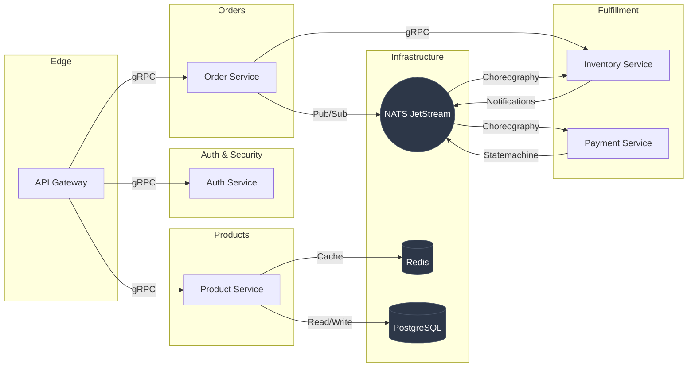
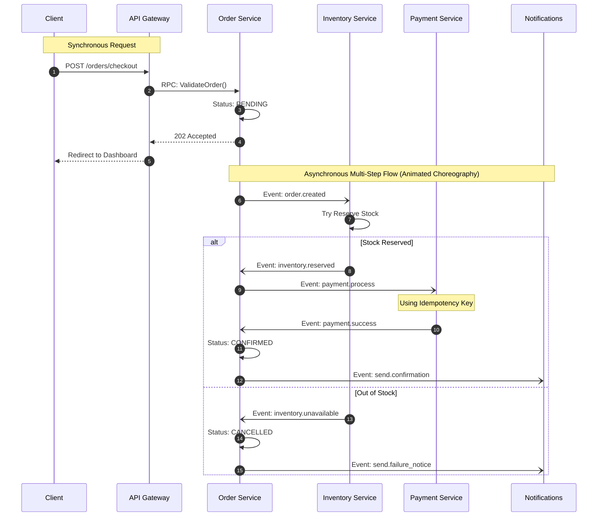
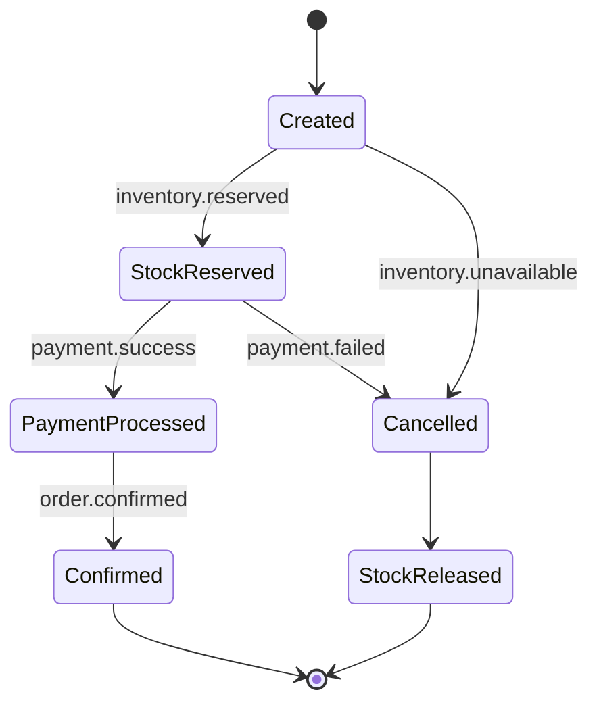

# 🌐 Skyline Shop: Engineering Wiki

Welcome to the official technical documentation for the **E-Commerce Microservices Platform**. This wiki provides a deep dive into the architecture, service landscape, and core transaction flows of the project.

---

## 📋 Table of Contents

1. [Project Vision](#-project-vision)
2. [System Architecture](#-system-architecture)
3. [Microservice Catalog](#-microservice-catalog)
4. [Core Transaction Flows](#-core-transaction-flows)
5. [Engineering Standards](#-engineering-standards)
6. [Resiliency & Scaling](#-resiliency--scaling)

---

## 🚀 Project Vision

The **Skyline Shop** is a production-grade distributed systems reference architecture designed for extreme scale and high availability. It demonstrates elite-level patterns used by top-tier engineering teams.

> **📈 Scale Target:** 10M+ registered users • 1M+ SKU catalog • 10k+ concurrent sessions • thousands of orders/min.

| Pillar          | Strategy                     | Implementation                                                   |
| :-------------- | :--------------------------- | :--------------------------------------------------------------- |
| **Performance** | High-throughput, Low-latency | **gRPC** Protocol Buffers & **Redis** Multi-layer Caching        |
| **Security**    | Zero-Trust Defense           | **PGP Payload Signing** & **RBAC** Authorization                 |
| **Scalability** | Horizontal Partitioning      | **Application-Level Sharding** & **NATS JetStream** Choreography |
| **Reliability** | Fault Tolerance              | **Saga Pattern**, **Circuit Breakers**, and **DLQs**             |

---

## 🖼️ UI Showcase

| | |
| :--- | :--- |
| **🏠 Home / Banner & Navbar** | **🛍️ All Products** |
|  |  |
| **📦 Product Details** | **⭐ Product Reviews** |
|  |  |
| **🛒 Cart** | **📦 Order Details / Tracking** |
|  |  |

---

## 🗺️ System Architecture

Our architecture follows a **Decentralized Microservices** model with a centralized API Gateway and Event-Driven choreography.

```mermaid
graph TD
    subgraph "Edge Layer (Public)"
        LB[Nginx Load Balancer]
        GW[API Gateway - NestJS]
    end

    subgraph "Identity & Security (Internal)"
        Auth[Auth Service]
        PMG[PGP Key Manager]
    end

    subgraph "Core Domain Services (Private)"
        Order[Order Service]
        Product[Product Service]
        Cart[Cart Service]
        Payment[Payment Service]
        Inv[Inventory Service]
        Avail[Availability Service]
    end

    subgraph "Data & Event Plane"
        NATS((NATS JetStream))
        Redis[(Redis Cache)]
        PGS[(Postgres Shards + Replicas)]
        ES[(Elasticsearch x3)]
        CH[(ClickHouse)]
    end

    LB --> GW
    GW -- gRPC --> Auth
    GW -- gRPC --> Order
    GW -- gRPC --> Product
    GW -- gRPC --> Cart

    Order -- Events --> NATS
    Product -- Search/Index --> ES
    Product -- Persistence --> Redis
    Product -- Persistence --> PGS
    Analytics -- Sink --> CH

    NATS -- Trigger --> Payment
    NATS -- Trigger --> Inv
    NATS -- Trigger --> Notif[Notification Service]

    style NATS fill:#22d3ee,stroke:#0891b2,stroke-width:4px
    style ES fill:#f59e0b,stroke:#b45309,stroke-width:2px
    style CH fill:#f59e0b,stroke:#b45309,stroke-width:2px
    style LB fill:#1e293b,stroke:#6366f1,stroke-width:2px
    style Auth fill:#0f172a,stroke:#a855f7
    style PGS fill:#334155,stroke:#475569
```

---

## 📦 Microservice Catalog

Detailed breakdown of the core services and their responsibilities.

| Service                 | Primary Domain             | Integration Pattern | Data Store                          |
| :---------------------- | :------------------------- | :------------------ | :---------------------------------- |
| **API Gateway**         | Request Proxy, Edge Auth   | REST / gRPC         | —                                   |
| **Auth Service**        | Identity, RBAC, PGP        | gRPC                | PostgreSQL                          |
| **User Service**        | User profile, preferences  | gRPC                | PostgreSQL                          |
| **Order Service**       | Checkout, Saga Logic       | NATS / gRPC         | PostgreSQL (sharded ×4)             |
| **Product Service**     | Catalog, Search, Sharding  | gRPC                | Postgres (sharded ×4) / Redis / ES  |
| **Cart Service**        | Cart lifecycle             | gRPC                | Redis / PostgreSQL                  |
| **Inventory Service**   | Stock, Locking Logic       | NATS / gRPC         | PostgreSQL                          |
| **Availability Service**| Pincode delivery SLA       | gRPC                | PostgreSQL                          |
| **Payment Service**     | Processing, Idempotency    | NATS                | Redis (Idempotency Key)             |
| **Notification Service**| Email/push notifications   | NATS                | —                                   |
| **Analytics Service**   | User Data, Sales Reporting | NATS (Sink)         | ClickHouse / Postgres               |

---

## 📊 Project Dependency Graph

This graph visualizes the inter-service dependencies and communication protocols.

---

## 📈 Service Dependency Matrix

The following table summarizes the upstream and downstream dependencies for every service in the project.

| Service                  | Protocol    | Upstream      | Downstream           | Data Store        |
| :----------------------- | :---------- | :------------ | :------------------- | :---------------- |
| **API Gateway**          | REST / gRPC | Client        | Auth, Order, Product | —                 |
| **Auth Service**         | gRPC        | API Gateway   | —                    | PostgreSQL        |
| **Order Service**        | gRPC / NATS | API Gateway   | Inventory, NATS      | PostgreSQL        |
| **Product Service**      | gRPC        | API Gateway   | —                    | PostgreSQL, Redis |
| **Inventory Service**    | gRPC / NATS | Order Service | NATS                 | PostgreSQL        |
| **Payment Service**      | NATS        | —             | NATS                 | Redis             |
| **Notification Service** | NATS        | —             | —                    | —                 |

---

## ⚡ Core Transaction Flows

### 🛒 Distributed Checkout (Saga Choreography)

We use the **Saga Pattern** to ensure consistency across multiple services without creating a distributed monolith.

---

## 🔄 Service State Transitions

This diagram shows the lifecycle of an Order across the platform.

---

## 🛡️ Engineering Standards

We maintain a strict set of standards to ensure the platform remains professional and maintainable.

### 1. Zero-Trust Communication

Internal services do not trust each other implicitly.

- **PGP Signing**: All cross-service gRPC payloads are signed by the originator.
- **MTLS**: (In Roadmap) Mutual TLS for all container networking.

### 2. Event Persistence

- **At-Least-Once Delivery**: Provided via NATS JetStream.
- **Idempotency**: Every event handler MUST be idempotent. We use Redis to track `eventId` for 24 hours.

### 3. Observability

- **Metrics**: Every new module must expose custom Prometheus counters.
- **Correlation IDs**: Log entries must include the `x-correlation-id` to trace requests across the distributed mesh.

---

## 📈 Resiliency & Scaling

### Database Sharding Strategy

The `Product` and `Order` domains utilize **Horizontal Partitioning** to scale beyond a single node capacity.

1. **Shard Key**: `user_id` for orders, `category_id` or `hash(sku)` for products.
2. **Global IDs**: We use Snowflake or UUID7 to ensure unique IDs across shards.

### Fault Tolerance Patterns

- **Circuit Breaker**: Implemented at the Gateway for all high-risk downstream calls.
- **Bulkhead Pattern**: Isolating resource pools per service to prevent cascading exhaustion.
- **Backpressure**: NATS JetStream handles traffic spikes by buffering events for downstream workers.

---

> [!TIP]
> This documentation is generated from the project's living blueprints. For architectural decisions, refer to the [ADR Directory](./adr/).

## 📚 Further Reading

- **[Algorithms & Data Structures](./architecture/algorithms.md)** — the algorithm behind every feature: djb2 shard routing, weighted ranking, deal scoring, market-basket analysis, saga orchestration, circuit breakers.
- **[Database Architecture](./architecture/database-architecture.md)** — the five stores (Postgres shards, Redis, Elasticsearch, ClickHouse, NATS JetStream), what each holds, and why that arrangement scales.
- **[Getting Started](./infrastructure/getting-started.md)** — setup, running the stack, and AWS/Floci deployment.
- **[Architecture Index](./architecture/README.md)** — the full architecture documentation hub.

---

  MIT License • 2026 Skyline Microservices Hub

