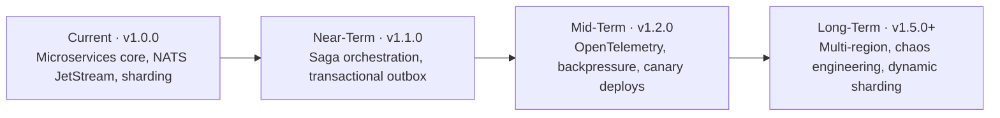

# 🗺️ Product Roadmap

This document outlines the engineering trajectory for the E-Commerce Microservices Platform. Our focus is on evolving from a robust microservices architecture to a hyper-scale, resilient platform.

## 🧭 Roadmap at a Glance

---

## ⚡ Current Capabilities (v1.0.0)

- ✅ **Microservices Core**: 10+ decoupled domain services.
- ✅ **NATS JetStream**: Persistent event bus for async choreography.
- ✅ **gRPC Orchestration**: High-speed synchronous internal calls.
- ✅ **Database Sharding**: Key-based horizontal partitioning for Products.
- ✅ **Zero-Trust Security**: PGP signed payloads and RBAC.

---

## 🚀 Near-Term (v1.1.0) - Resiliency & Scale

- 🔄 **Saga Orchestration**: Implementing a formal Saga coordinator for distributed transactions (Checkout Flow).
- 🔄 **Transactional Outbox**: Ensuring atomicity between database updates and event publishing.
- 🔄 **Service Mesh Integration**: Moving cross-cutting concerns (Retries, Timeouts) to a sidecar (Istio/Linkerd).
- 🔄 **Advanced Rate Limiting**: Distributed rate-limiting using Redis fixed-window counters.

---

## 🏗️ Mid-Term (v1.2.0) - Platform & DX

- ⬜ **OpenTelemetry Integration**: Full distributed tracing across all services with Jaeger/Zipkin.
- ⬜ **Backpressure Handling**: Implementing reactive streams for high-volume event processing.
- ⬜ **Canary Deployments**: Automated traffic shifting for safer production releases.
- ⬜ **Custom Dev CLI**: A dedicated CLI tool for scaffolding new services and libs.

---

## 🌌 Long-Term (v1.5.0+) - Expert Scale

- ⬜ **Multi-Region Replication**: Low-latency global data distribution.
- ⬜ **Chaos Engineering**: Automated failure injection (Chaos Monkey style) to test resiliency.
- ⬜ **Dynamic Sharding**: Rebalancing data shards without downtime.
- ⬜ **AI-Powered Observability**: Predictive scaling based on historical traffic patterns.

---

## 🛠️ Contribution

We welcome PRs for any of the roadmap items! Please refer to **[CONTRIBUTING.md](../CONTRIBUTING.md)** for engineering standards.

---

  MIT License • 2026 Production-Grade Engineering Hub

