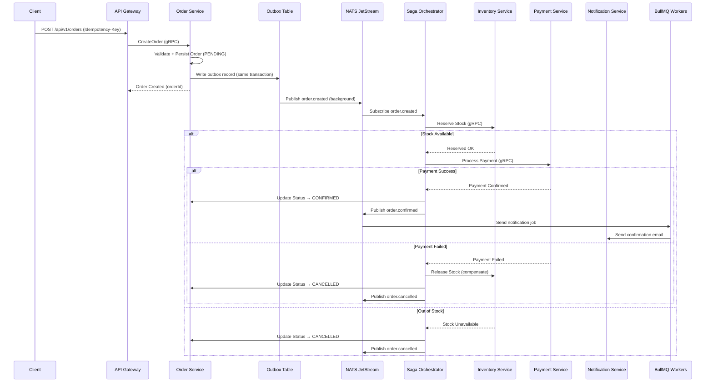
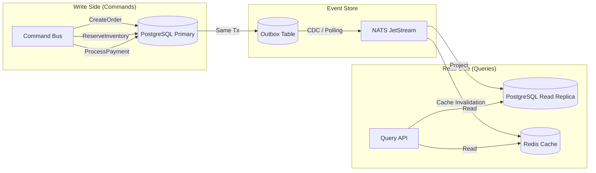
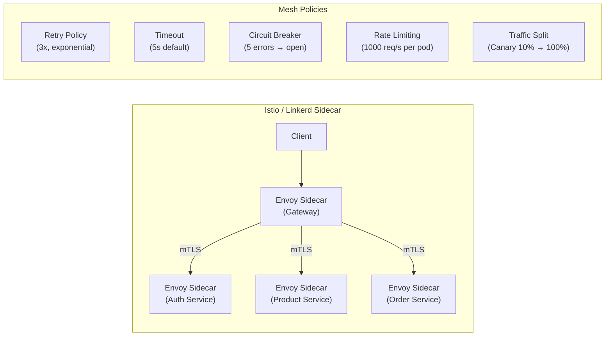
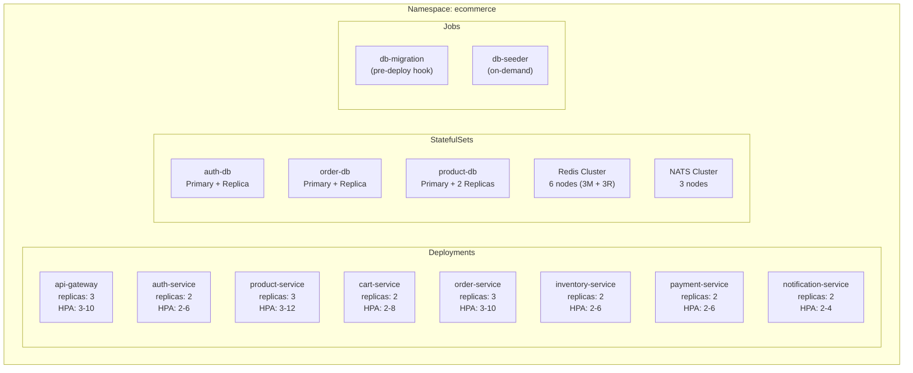

# Skyline Commerce — Production Architecture

## Overview

Distributed e-commerce microservices platform designed for 10M+ users with
horizontal scaling, zero-downtime deployments, fault tolerance, and multi-region readiness.

---

## Architecture Diagram

```mermaid
graph TB
    subgraph "Client Layer"
        WebApp["Web App<br/>(React + Vite)"]
        MobileApp["Mobile App"]
    end

    subgraph "Edge Layer"
        CloudLB["Cloud Load Balancer<br/>(TLS Termination, WAF)"]
        NginxGW["Nginx / Envoy<br/>(Rate Limiting, Request Validation)"]
    end

    subgraph "API Gateway Cluster"
        GW1["API Gateway Pod 1"]
        GW2["API Gateway Pod 2"]
        GW3["API Gateway Pod 3"]
    end

    subgraph "Service Mesh (Istio / Linkerd)"
        subgraph "Auth Service"
            A1["Auth Pod 1"]
            A2["Auth Pod 2"]
        end

        subgraph "Product Service"
            P1["Product Pod 1<br/>Write"]
            P2["Product Pod 2<br/>Write"]
            P3["Product Pod 3<br/>Read"]
        end

        subgraph "Cart Service"
            C1["Cart Pod 1"]
            C2["Cart Pod 2"]
        end

        subgraph "Order Service"
            O1["Order Pod 1<br/>Command"]
            O2["Order Pod 2<br/>Command"]
            O3["Order Pod 3<br/>Read"]
        end

        subgraph "Inventory Service"
            I1["Inventory Pod 1"]
            I2["Inventory Pod 2"]
        end

        subgraph "Payment Service"
            PY1["Payment Pod 1"]
            PY2["Payment Pod 2"]
        end

        subgraph "Notification Service"
            N1["Notification Pod 1"]
        end
    end

    subgraph "Event Streaming Layer"
        NATS["NATS JetStream<br/>(3-node cluster)<br/>Business Events Only"]
        BullMQ["BullMQ<br/>(Redis-backed)<br/>Background Jobs Only"]
    end

    subgraph "Data Layer"
        subgraph "PostgreSQL Cluster"
            PGW1["PG Auth Primary<br/>(Write)"]
            PGW2["PG Order Primary<br/>(Write)"]
            PGW3["PG Product Primary<br/>(Write)"]
            PGR1["PG Auth Replica<br/>(Read)"]
            PGR2["PG Order Replica<br/>(Read)"]
            PGR3["PG Product Replica<br/>(Read)"]
            PgBouncer["PgBouncer<br/>(Connection Pool)"]
        end

        subgraph "Redis Cluster"
            R1["Redis Shard 1<br/>(Cache + Sessions)"]
            R2["Redis Shard 2<br/>(BullMQ Backend)"]
            R3["Redis Shard 3<br/>(Distributed Locks)"]
        end
    end

    subgraph "Saga Orchestrator"
        SagaOrch["Order Saga<br/>Orchestrator"]
    end

    subgraph "Outbox Publisher"
        OutboxPub["Outbox Background<br/>Publisher"]
    end

    subgraph "Observability Stack"
        OTel["OpenTelemetry<br/>Collector"]
        Jaeger["Jaeger<br/>(Distributed Tracing)"]
        Prometheus["Prometheus<br/>(Metrics)"]
        Grafana["Grafana<br/>(Dashboards)"]
        AlertMgr["AlertManager<br/>(PagerDuty/Slack)"]
        ELK["ELK Stack<br/>(Structured Logs)"]
    end

    subgraph "CI/CD Pipeline"
        GHActions["GitHub Actions<br/>(Build + Test)"]
        ArgoCD["ArgoCD<br/>(GitOps Deploy)"]
        Harbor["Harbor<br/>(Container Registry)"]
    end

    subgraph "Kubernetes Cluster"
        HPA["HPA<br/>(Auto-scaling)"]
        PDB["PDB<br/>(Disruption Budget)"]
        SecretMgr["External Secrets<br/>(Vault/AWS SM)"]
    end

    WebApp --> CloudLB
    MobileApp --> CloudLB
    CloudLB --> NginxGW
    NginxGW --> GW1 & GW2 & GW3

    GW1 & GW2 & GW3 -->|"gRPC + HTTP"| A1 & A2
    GW1 & GW2 & GW3 -->|"gRPC + HTTP"| P1 & P2 & P3
    GW1 & GW2 & GW3 -->|"gRPC + HTTP"| C1 & C2
    GW1 & GW2 & GW3 -->|"gRPC + HTTP"| O1 & O2 & O3

    O1 & O2 -->|"gRPC"| I1 & I2
    O1 & O2 -->|"gRPC"| PY1 & PY2

    O1 & O2 -->|"Publish events"| NATS
    NATS -->|"order.created"| SagaOrch
    SagaOrch -->|"reserve inventory"| I1 & I2
    SagaOrch -->|"process payment"| PY1 & PY2
    SagaOrch -->|"send notification"| BullMQ

    I1 & I2 -->|"Publish"| NATS
    PY1 & PY2 -->|"Publish"| NATS

    P1 & P2 & P3 -->|"Cache-Aside"| R1
    O1 & O2 & O3 -->|"Read/Write"| PgBouncer
    A1 & A2 -->|"Read/Write"| PgBouncer
    I1 & I2 -->|"SELECT FOR UPDATE"| PgBouncer
    PgBouncer --> PGW1 & PGW2 & PGW3
    PGW1 --> PGR1
    PGW2 --> PGR2
    PGW3 --> PGR3

    P1 & P2 & P3 & O1 & O2 & O3 & A1 & A2 & I1 & I2 & PY1 & PY2 --> OTel
    OTel --> Jaeger
    OTel --> Prometheus
    Prometheus --> Grafana
    Prometheus --> AlertMgr
    P1 & P2 & P3 & O1 & O2 & O3 --> ELK

    GHActions --> Harbor
    ArgoCD --> K8s
```

---

## Data Flow — Order Saga

---

## CQRS Pattern

---

## Service Mesh Topology

---

## Kubernetes Deployment

---

## Component Legend

| Layer | Technology | Purpose |
|-------|-----------|---------|
| Edge | Cloud LB + Nginx/Envoy | TLS, WAF, rate limiting, request validation |
| Gateway | NestJS API Gateway | Auth, routing, API versioning, Swagger |
| Mesh | Istio/Linkerd | mTLS, retries, timeouts, circuit breakers, traffic splitting |
| Sync | gRPC | Inter-service synchronous communication |
| Async | NATS JetStream | Business event streaming (order.created, payment.success) |
| Jobs | BullMQ | Background tasks (emails, invoices, analytics) |
| Cache | Redis Cluster | Sessions, read cache, distributed locks |
| DB | PostgreSQL + PgBouncer | ACID transactions, read replicas, connection pooling |
| Tracing | OpenTelemetry + Jaeger | Distributed tracing across all services |
| Metrics | Prometheus + Grafana + AlertManager | SLIs, SLOs, error budgets, alerting |
| Logs | ELK Stack | Centralized structured logging |
| CI/CD | GitHub Actions + ArgoCD | Build, test, GitOps deploy, canary releases |
| Secrets | External Secrets Operator | Vault / AWS Secrets Manager integration |
