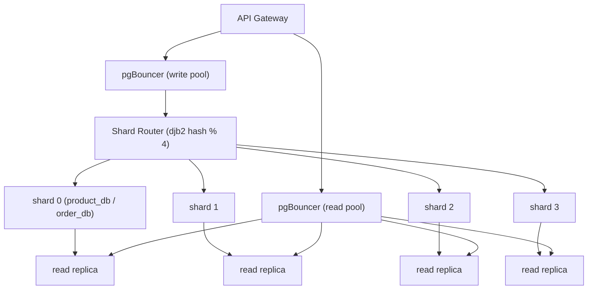
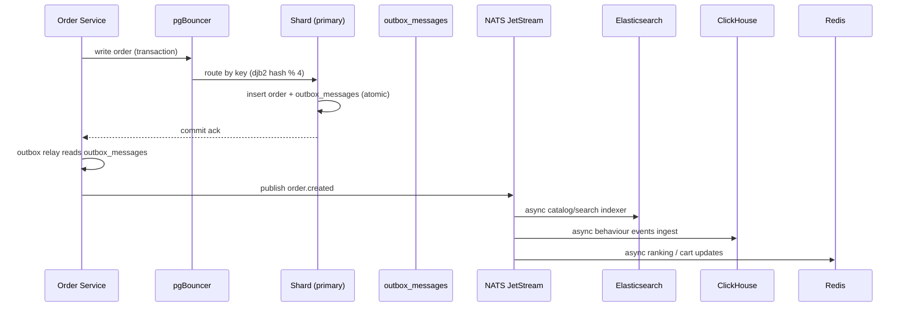

# 🗄️ Database Architecture

One database technology cannot serve every workload well. Skyline Shop uses **five complementary stores**, each chosen for the shape of the data and the access pattern it serves — and this document explains the _why_ behind that arrangement.

```
                    ┌────────────────────────────────────────────────┐
                    │                 API GATEWAY                    │
                    └───────┬──────────┬──────────┬────────┬─────────┘
                            │          │          │        │
                  ┌─────────▼──┐  ┌────▼─────┐  ┌─▼────┐  ┌▼──────────┐
                  │ POSTGRES   │  │  REDIS   │  │  ES  │  │ CLICKHOUSE│
                  │ (source of │  │ (hot in- │  │(search│  │ (analytics│
                  │  truth,    │  │ memory)  │  │ +rank)│  │  sink)    │
                  │  sharded)  │  │          │  │      │  │           │
                  └────────────┘  └──────────┘  └──────┘  └───────────┘
        NATS JetStream (event bus / durable streams) — bridges services
```

---

## 🧱 The Five Stores

| Store              | Role                           | What it holds                                                        | Access pattern                        |
| :----------------- | :----------------------------- | :------------------------------------------------------------------- | :------------------------------------ |
| **PostgreSQL**     | Source of truth                | Users, products, inventory, orders, payments, carts, reviews, outbox | Strongly-consistent transactions      |
| **Redis**          | Hot in-memory cache + counters | Carts, sessions, idempotency keys, ranked lists, recently-viewed     | Sub-ms reads, TTLs                    |
| **Elasticsearch**  | Search & discovery             | Denormalized product index                                           | Relevance-ranked queries              |
| **ClickHouse**     | OLAP analytics                 | Behaviour events (views, searches, purchases)                        | High-volume inserts, range aggregates |
| **NATS JetStream** | Durable event bus              | Domain events, DLQs                                                  | At-least-once async delivery          |

---

## 🐘 1. PostgreSQL — Source of Truth (sharded)

### Purpose

Every **authoritative, transactional record** lives here: accounts, products, stock, orders, payments, reviews. PostgreSQL is chosen for **ACID transactions** and rich SQL — exactly what a commerce backend needs for money and inventory correctness.

### Arrangement — per-domain databases, sharded

```
auth_db                     availability_db
└── users, refresh_tokens   └── warehouses, pincode_serviceability
                             └── warehouse_inventory, inventory_reservations

product_db × 4 (shards)     order_db × 4 (shards)
  s0 s1 s2 s3                 s0 s1 s2 s3
  └─ products, inventory,     └─ orders, order_items,
     reviews, categories         payments, outbox_messages,
                                  idempotency_keys
```

Each domain is a **separate database** so it can be scaled, backed up, and owned independently. Within the hot domains (product, order), data is **sharded 4 ways** by key (djb2 hash → `% 4`) so no single Postgres instance holds the whole catalog or all orders. Each shard has a **primary + read replica** and is fronted by **pgBouncer** (write pool / read pool) for connection efficiency.

### Diagram — sharded PostgreSQL topology



### Why this arrangement

| Why                           | Reason                                                                                        |
| :---------------------------- | :-------------------------------------------------------------------------------------------- |
| One DB per domain             | Independent scaling, failure isolation, and ownership                                         |
| Shard product/order           | Write throughput is the bottleneck at 10M+ users; splitting by key scales writes horizontally |
| Read replicas                 | Browse-heavy e-commerce is ~90% reads; replicas absorb them without competing with writes     |
| pgBouncer pools               | Postgres can't handle thousands of idle connections; pooling reuses them                      |
| `outbox_messages` in order DB | Events commit atomically with the order → zero event loss                                     |

---

## ⚡ 2. Redis — Hot In-Memory Layer

### Purpose

Redis covers the **fast-path** reads and ephemeral state that don't need to hit Postgres:

- **Cart** — `Cart`/`CartItem` operations served hot with TTLs (persisted server-side on checkout).
- **Sessions & rate limiting** — short-lived keys.
- **Idempotency keys** — duplicate request suppression for payments/orders.
- **Discovery counters** — real-time per-day `ZINCRBY` on sorted sets.
- **Ranked lists** — `discovery:trending:*`, `bestsellers:*`, `deals:*`, `products:meta` published by the ranking engine.

### Why Redis and not Postgres for these

Sub-millisecond latency and atomic `ZADD/ZINCRBY` operations make Redis the right tool for **hot counters and rankings**; Postgres would be wasted on these ephemeral, high-QPS workloads and would create lock contention.

---

## 🔍 3. Elasticsearch — Search & Ranking

### Purpose

A **denormalized product index** (`products` index, 3-node cluster) powers:

- Full-text relevance search (multi-match, BM25)
- Faceted category + **INR price-range filters**
- Autocomplete suggestions (keyword prefix)
- Similar products, deals, and ranked discovery hydration

### Why Elasticsearch

PostgreSQL's `LIKE '%term%'` scans don't scale for 1M+ SKUs. ES uses an **inverted index** and **BM25 ranking** to return relevance-ordered results in <100 ms p99. It is written via a background indexer (product service) so the catalog DB stays authoritative and ES stays eventually-consistent — best of both worlds.

---

## 📊 4. ClickHouse — OLAP Analytics

### Purpose

A columnar **MergeTree** store (`analytics.behaviour_events`, partitioned by day) that ingests the full behaviour event stream (views, searches, carts, purchases) and powers:

- The ranking engine's signal aggregation (7/30-day windows)
- Frequently-bought co-occurrence analysis
- Sales reporting & trend queries

### Why ClickHouse

Behaviour events are **append-heavy, analyze-in-bulk** — the exact workload OLAP column stores crush. Running these aggregates on transactional Postgres would bloat the OLTP databases and slow the checkout path.

---

## ✈️ 5. NATS JetStream — Durable Event Bus

### Purpose

NATS JetStream (5-node cluster) carries the **async backbone**: `order.*`, `inventory.*`, `payment.*`, `behaviour.event`, plus **dead-letter queues** for failed consumers.

### Why NATS

Sub-millisecond pub/sub with **durable streams** gives at-least-once delivery, and the lightweight protocol keeps message cost near zero — so services can emit domain events freely without coupling to consumers.

---

## 🔀 Why This Overall Arrangement Works

1. **Right tool per workload** — transactions → Postgres, hot reads → Redis, search → ES, analytics → ClickHouse, events → NATS. No single database is forced to do everything.
2. **Eventually-consistent fan-out** — the authoritative write goes to Postgres; ES/ClickHouse/Redis are updated asynchronously. The read path is optimized per surface (search off ES, rankings off Redis, dashboards off ClickHouse).
3. **Scale independently** — shard product/order DBs horizontally, add ES nodes for search, scale analytics ingest in ClickHouse, and never touch the transactional path.
4. **Event-driven decoupling** — services own their stores and communicate through NATS, so no service reaches into another's database.

### Diagram — a sharded write fan-out



---

## 📚 Related

- [Algorithms & Data Structures](./algorithms.md) — the hashing/scoring behind this layout.
- [Scaling & Sharding](../infrastructure/scaling-and-sharding.md) — throughput math and topology.
- [Prisma schema](../../prisma/schema.prisma) — the canonical data model.

[⬅️ Back to Architecture Index](./README.md)
