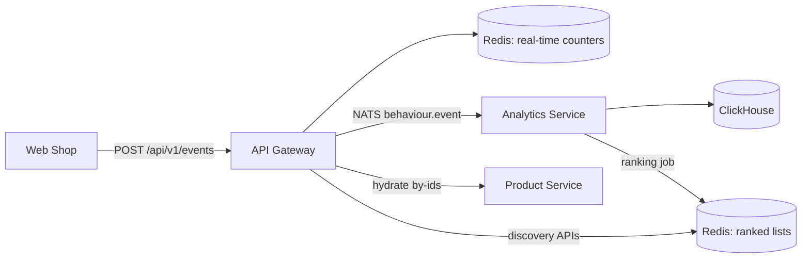

# 🔍 Discovery, Behaviour Events & Ranking

The platform serves personalised discovery surfaces (home, trending, best sellers,
deals, recommendations, recently viewed, similar, frequently bought) backed by a
real-time behaviour event pipeline that feeds a periodic ranking engine.

## Data Flow



1. **Collection** — the web shop (and any client) POSTs behaviour events
   (`PRODUCT_VIEW`, `SEARCH`, `SEARCH_CLICK`, `ADD_TO_CART`, `WISHLIST_ADD`,
   `PURCHASE`, `PRODUCT_SHARE`, `IMPRESSION`, ...) to `POST /api/v1/events`.
2. **Real-time counters** — the gateway writes per-day, per-event-type sorted sets
   and the global `discovery:product-views` zset via `RedisDiscoveryService`.
   Per-user signal lists (`discovery:user:<actor>:<type>`) and recent-viewed lists
   are maintained for anonymous guests and authenticated users.
3. **Sink** — the same event is published to NATS (`behaviour.event`) and consumed
   by the analytics-service, which inserts it into ClickHouse
   (`analytics.behaviour_events`, `MergeTree` partitioned by day).
4. **Ranking** — the analytics-service runs a background job
   (`RankingEngineService`, interval `RANKING_INTERVAL_MS`, default 15 min) that:
   - aggregates the last 7/30 days of signals from Redis,
   - applies profile weights (`default`, `trending`, `bestsellers`),
   - applies admin boosts (`discovery:boosts`),
   - writes ranked id lists to Redis (`discovery:trending:global`,
     `discovery:bestsellers:<category>`, `discovery:deals:global`, ...) with TTLs,
   - computes frequently-bought-together pairs from ClickHouse purchase sessions,
   - caches product metadata (`discovery:products:meta`) for recommendations.
5. **Serving** — the gateway reads the ranked lists from Redis and hydrates them
   into full product payloads by calling the product-service `by-ids` endpoint.

## Discovery APIs (all under `/api/v1`)

| Endpoint | Description |
| --- | --- |
| `GET /discovery/home` | Aggregates trending + deals + best sellers + recent + recommendations |
| `GET /discovery/trending?category=&limit=` | Trend-ranked products (global or per-category) |
| `GET /discovery/best-sellers?category=&limit=` | Best-seller ranked products |
| `GET /discovery/deals?limit=` | Discounted products ranked by deal score |
| `GET /recommendations?limit=` | Personalised recs from browsing history |
| `GET /user/recent-products?limit=` | Recently viewed products for the current actor |
| `GET /products/by-ids?ids=` | Bulk product hydration used by discovery |
| `GET /products/:id/similar` | Similar products (OpenSearch vector/semantic) |
| `GET /products/:id/frequently-bought` | Co-purchase products (ClickHouse analysis) |
| `POST /events` | Ingests a behaviour event |

## Admin Controls

- `POST /admin/discovery/boost` — set a merchandising boost score (0–100) for a product (`ADMIN`/`MANAGER`).
- `DELETE /admin/discovery/boost/:productId` — remove a boost.

Boosts are stored in Redis (`discovery:boosts`) and consumed by the ranking engine
on the next run; boosted products float up in all ranked lists.

## Components

- `libs/common/src/events` — shared event types/DTOs (`BehaviourEvent`, `BehaviourEventType`).
- `libs/common/src/behaviour/redis-discovery.service.ts` — Redis keys, counters, ranked lists, boosts, TTLs.
- `apps/analytics-service/src/clickhouse.service.ts` — schema bootstrap + inserts.
- `apps/analytics-service/src/behaviour.controller.ts` — NATS consumer for `behaviour.event`.
- `apps/analytics-service/src/ranking-engine.service.ts` — scoring + ranked-list publishing.
- `apps/api-gateway/src/api-gateway.controller.ts` — ingestion + discovery + admin endpoints.

## Local Verification

```bash
# start infra
docker compose up -d clickhouse redis nats
# start analytics + product services, then the gateway (see docker-compose service env)
# smoke test
curl -X POST http://localhost:3000/api/v1/events \
  -H 'Content-Type: application/json' \
  -d '{"eventType":"PRODUCT_VIEW","productId":"<id>","quantity":1}'
curl http://localhost:3000/api/v1/discovery/trending?limit=5
```
