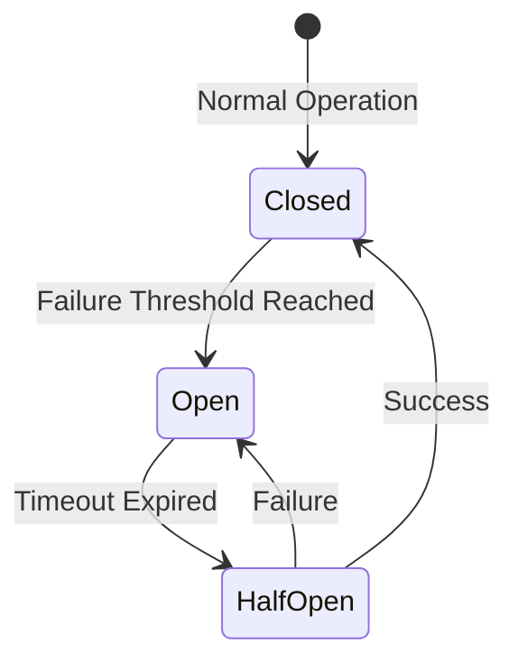

# 🚀 Resiliency Patterns

To ensure the platform remains stable under load or partial failures, we implement several production-grade resiliency patterns.

## 🛡️ Core Patterns

### 1. Circuit Breaker

Prevents a failing service from cascading errors across the system.

### 2. Retry with Exponential Backoff

Handles transient failures (network blips, service restarts) by retrying with increasing delays.

| Attempt | Delay  | Logic           |
| :------ | :----- | :-------------- |
| 1       | 100ms  | Immediate retry |
| 2       | 400ms  | `base * 2^n`    |
| 3       | 1600ms | `base * 2^n`    |

### 3. Dead Letter Queues (DLQ)

Ensures that messages that cannot be processed by NATS after multiple retries are not lost but moved to a specific queue for manual inspection.

---

[⬅️ Back to Architecture Index](./README.md)
