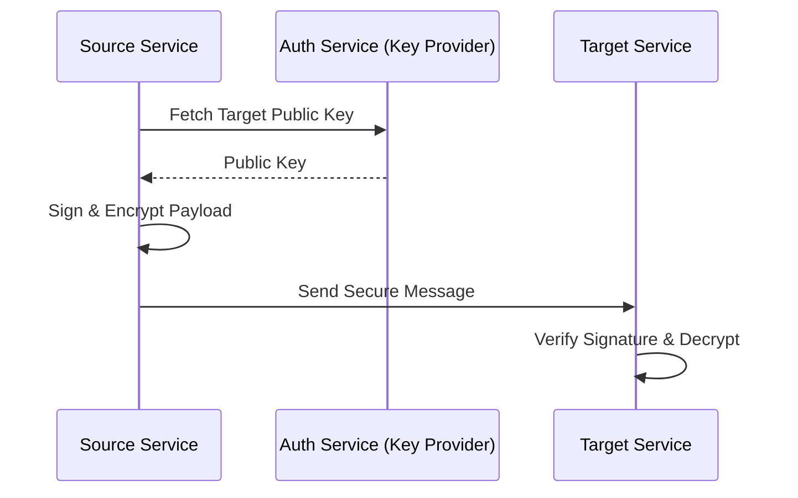

# 🔐 Security Architecture

The platform follows a **Zero-Trust** and **Defense-in-Depth** strategy.

## 🛡️ Security Layers

### 1. Identity & Access (IAM)

- **JWT**: Stateless authentication with short-lived tokens.
- **RBAC**: Role-Based Access Control (Admin, Vendor, Customer).

### 2. Data Protection

- **Encryption at Rest**: PostgreSQL TDE.
- **Encryption in Transit**: TLS for all gRPC and HTTP traffic.
- **Sensitive Payloads**: We use **OpenPGP** to sign/encrypt high-value messages between services.

## 🔄 Signature Flow (PGP)

---

[⬅️ Back to Architecture Index](./README.md)
