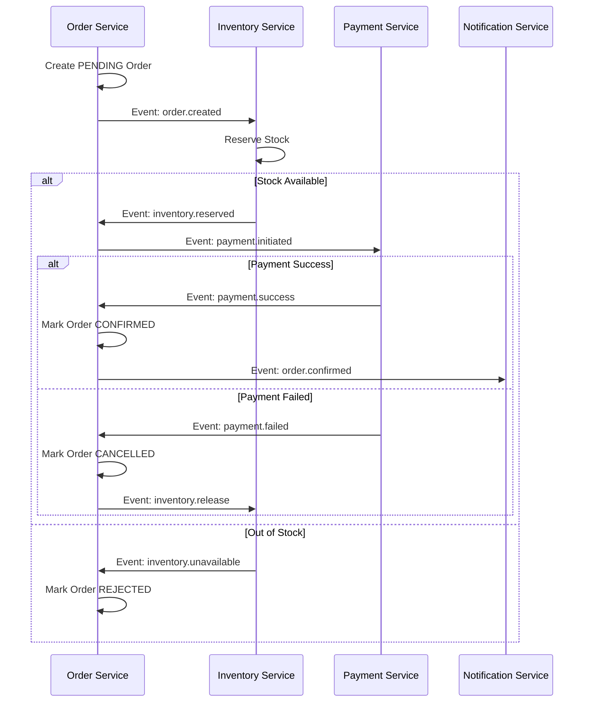
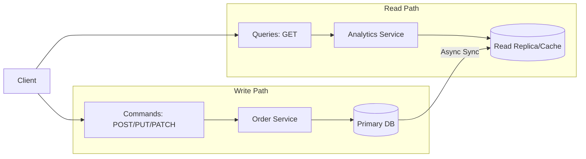
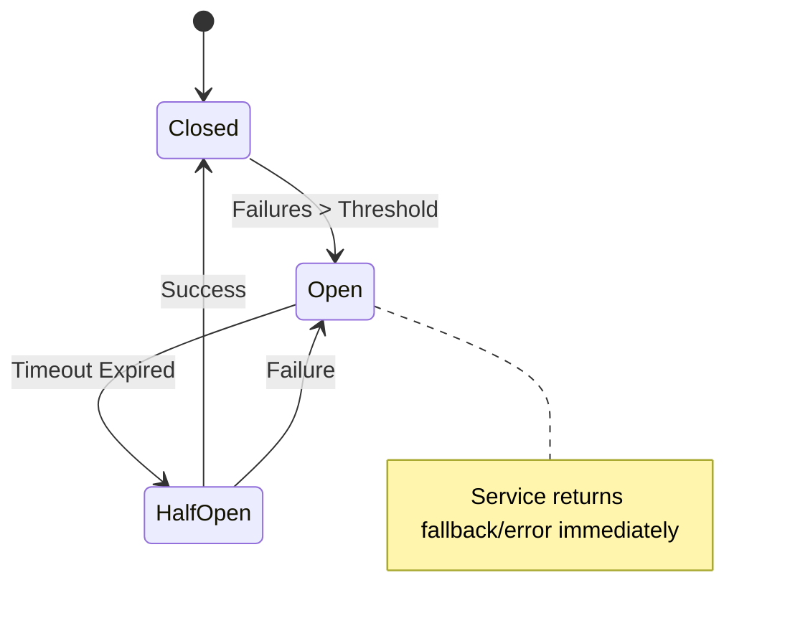

# 🏗️ System Design & Architecture

  
  
  
  

This document provides a deep-dive into the core engineering principles and architectural patterns that define the E-Commerce Microservices Platform.

---

## 🏛️ Architectural Philosophy

| Principle               | Strategic Intent                                            | Implementation                                                       |
| :---------------------- | :---------------------------------------------------------- | :------------------------------------------------------------------- |
| **Decentralization**    | Eliminate single points of failure and domain coupling.     | Independent service runtimes and dedicated databases per domain.     |
| **Event-Driven**        | Maximize system availability and eventual consistency.      | Async choreography using NATS JetStream for all post-checkout flows. |
| **Clean Architecture**  | Ensure long-term maintainability and framework agnosticism. | Strict separation of Domain, Application, and Infrastructure layers. |
| **Observability First** | Guarantee system visibility in a distributed environment.   | Native Prometheus metrics and structured logging in every service.   |

---

## 🗺️ Core Patterns

### 🔄 Saga Pattern (Distributed Transactions)

Since we maintain dedicated databases for every service, we use the **Saga Choreography Pattern** to ensure eventual consistency across the platform.

### ⚡ CQRS (Command Query Responsibility Segregation)

We optimize for asymmetric read/write loads by separating the paths for data modification and data retrieval.

---

## 🛡️ Security-in-Depth

| Security Layer        | Implementation Detail          | Risk Mitigated                            |
| :-------------------- | :----------------------------- | :---------------------------------------- |
| **Edge Security**     | Nginx Rate Limiting & TLS 1.3  | DDoS attacks & Man-in-the-Middle.         |
| **Identity**          | JWT with RSA-256 signatures    | Unauthorized API access.                  |
| **Payload Integrity** | **OpenPGP** Asymmetric Signing | Internal message spoofing & tampering.    |
| **Data at Rest**      | AES-256 DB Encryption          | Physical data theft or snapshot exposure. |

---

## �️ Resiliency & Reliability

---

## 📈 Observability Philosophy

We follow the **Three Pillars of Observability**:

1.  **Metrics**: Prometheus counters/gauges for system health.
2.  **Logging**: Structured JSON logs with `correlation_id` for tracing.
3.  **Tracing**: (In Roadmap) Distributed request tracing across service boundaries.

---

  [⬅️ Back to README](../../README.md) • [Explore Service Catalog](../services/README.md)

