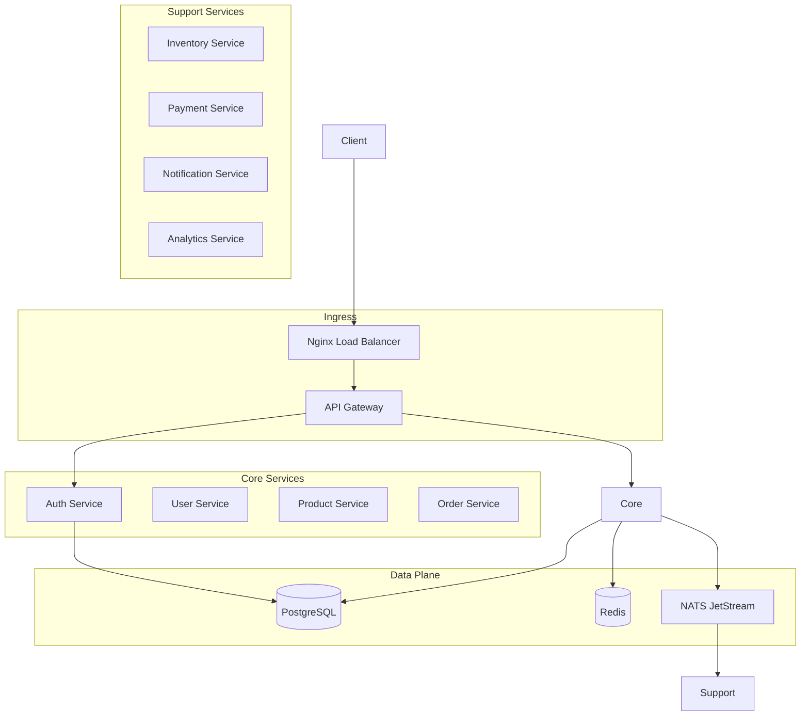

# 🏗️ System Overview

The **E-Commerce Microservices Platform** is designed for high availability, scalability, and maintainability.

## 🗺️ High-Level Architecture

The system follows a **decoupled microservices architecture** where each service owns its data and communicates primarily via asynchronous events.

## 🏗️ Architectural Patterns

### 1. Microservices

Each service is independently deployable and scalable. We use **pnpm workspaces** to manage the monorepo.

### 2. Event-Driven Architecture (EDA)

We use **NATS JetStream** for reliable, asynchronous communication between services. This ensures loose coupling and high resiliency.

### 3. CQRS (Command Query Responsibility Segregation)

Read and write operations are separated to optimize performance and scalability.

- **Commands**: State-changing operations (e.g., `CreateOrder`).
- **Queries**: Data-retrieval operations (e.g., `GetProductDetails`).

### 4. API Gateway

The gateway acts as the single entry point, handling:

- Routing
- Rate Limiting
- Authentication/Authorization
- Request Aggregation

---

[🔗 View Microservices Architecture](./microservices-architecture.md) | [⬅️ Back to Architecture Index](./README.md)
