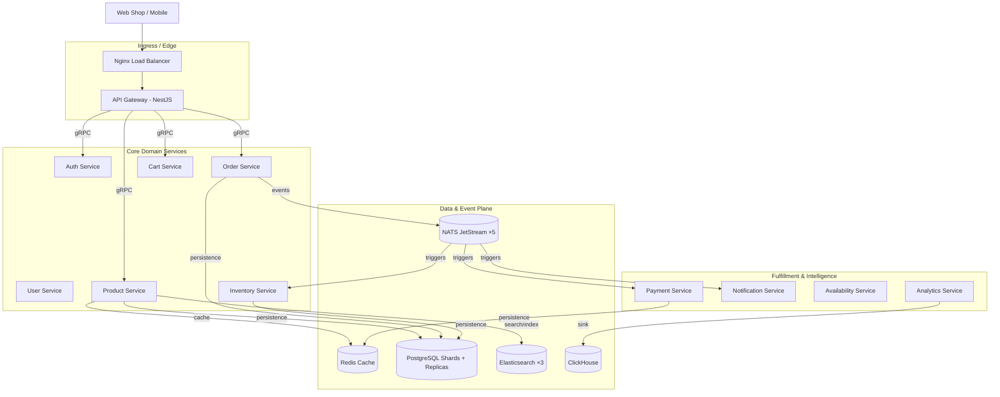

# 🏗️ System Overview

The **E-Commerce Microservices Platform** is designed for high availability, scalability, and maintainability — targeted at **10M+ users** with a **1M+ SKU** catalog.

## 🗺️ High-Level Architecture

The system follows a **decoupled microservices architecture** where each service owns its data and communicates primarily via asynchronous events, with synchronous gRPC calls for request/response paths.

## 🏗️ Architectural Patterns

### 1. Microservices

Each service is independently deployable and scalable. We use **pnpm workspaces** to manage the monorepo, and each service is containerized behind pgBouncer connection pools.

### 2. Event-Driven Architecture (EDA)

We use **NATS JetStream** (a 5-node cluster) for reliable, asynchronous communication between services. Events are persisted with at-least-once delivery and every consumer is idempotent.

### 3. Saga Orchestration (Checkout)

The **Order Service** runs a saga orchestrator that coordinates inventory reservation → payment → confirmation, with full compensation paths (release inventory on payment failure) and an **outbox table** for zero-loss event publishing.

### 4. CQRS & Command Query Responsibility Segregation

Read and write operations are separated to optimize performance and scalability.

- **Commands**: State-changing operations (e.g., `CreateOrder`).
- **Queries**: Data-retrieval operations (e.g., `GetProductDetails`).

### 5. API Gateway

The gateway acts as the single entry point, handling:

- Routing and **URI versioning** (`/api/v1/*`)
- Rate Limiting
- JWT Authentication/Authorization
- Request Aggregation
- gRPC → HTTP error mapping (e.g., gRPC `NOT_FOUND` → HTTP `404`)

## 📊 Data Layer

| Data Plane           | Purpose                                                    | Scale Notes                             |
| :------------------- | :--------------------------------------------------------- | :-------------------------------------- |
| **PostgreSQL**       | Source of truth per domain (auth, product ×4, order ×4)    | Sharded by key + read replicas          |
| **Elasticsearch**    | Product search, filters, recommendations, ranking          | 3-node cluster, < 100 ms p99            |
| **Redis**            | Cart, sessions, idempotency keys, ranked lists             | Multi-level caching                     |
| **ClickHouse**       | Behavior events, sales analytics (OLAP)                    | Columnar, high-ingestion sink           |
| **NATS JetStream**   | Event bus, DLQs, outbox relay                              | 5-node cluster, durable streams         |

---

## 🖼️ Storefront

A React 19 storefront consumes the gateway — see the [catalog browsing flow](../flows/catalog-browsing-flow.md), [checkout flow](../flows/checkout-flow.md), and [order tracking flow](../flows/track-order-flow.md) for end-to-end walks.

| **Home / Banner** | **All Products** | **Order Tracking** |
| :--- | :--- | :--- |
|  |  |  |

---

[🔗 View Microservices Architecture](./ARCHITECTURE.md) | [🔗 System Design Deep Dive](./system-design-deep-dive.md) | [⬅️ Back to Architecture Index](./README.md)
