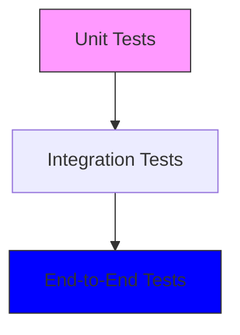
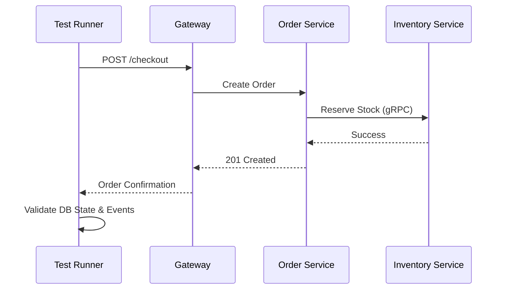

# 🧪 Testing Strategy

The E-Commerce Microservices Platform employs a **multi-layered testing strategy** to ensure reliability, performance, and data integrity across the distributed system.

## 🏗️ Testing Pyramid



---

## 🔬 Testing Layers

| Layer                 | Tooling         | Focus                                            | Location                          |
| :-------------------- | :-------------- | :----------------------------------------------- | :-------------------------------- |
| **Unit Tests**        | Jest            | Isolated business logic and service methods.     | `apps/{service}/src/**/*.spec.ts` |
| **Integration Tests** | Supertest, Jest | Service-to-DB and Service-to-Service gRPC calls. | `apps/{service}/test/`            |
| **E2E Tests**         | Supertest, NATS | Complete business flows (e.g., Checkout).        | `test/e2e/`                       |
| **Load Tests**        | K6 / Artillery  | System stability under high concurrent traffic.  | `test/load/`                      |

---

## 🌊 Testing Flows

### 1. Unit Testing Flow

We use standard NestJS testing utilities to mock dependencies and isolate the system under test.

```typescript
// Example: Mocking Prisma in PaymentService
const mockPrisma = { payment: { create: jest.fn() } };
```

### 2. Integration Testing (Service Isolation)

Each microservice has its own `test/` directory for integration tests. We spin up the service module with mocked external dependencies (like NATS) but real or in-memory databases.

### 3. Distributed E2E Flow

Testing flows that cross service boundaries:



---

## 🛠️ Running Tests

### All Services

```bash
# Unit Tests
pnpm run test

# Integration/E2E
pnpm run test:e2e

# Coverage Report
pnpm run test:cov
```

### Specific Service

```bash
# Navigate to service and run
cd apps/order-service
pnpm run test
```

---

## 🛡️ Testing Best Practices

- **Shared Mocks**: Common test utilities are shared via `libs/testing`.
- **Database Cleansing**: Automated scripts reset the test database between runs.
- **Contract Testing**: Ensuring gRPC and NATS payloads match across services.

---

[⬅️ Back to Home](../../README.md)
