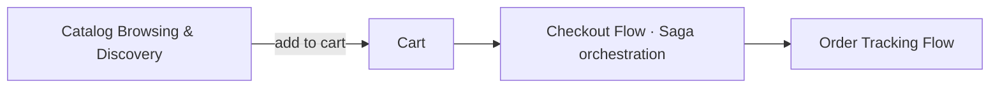

# 🌊 System Flows

Visualizing how data and events move through the system for core business processes — with real storefront screenshots.

## 🗺️ Flow Map

## 🖼️ UI Showcase

|                                                   |                                                   |
| :------------------------------------------------ | :------------------------------------------------ |
| **🏠 Home / Banner**                              | **🛍️ All Products**                               |
|                 |        |
| **📦 Product Details**                            | **⭐ Product Reviews**                            |
|  |  |
| **🛒 Cart**                                       | **📦 Order Details**                              |
|                        |      |

## 🔄 Business Processes

- **[Catalog Browsing & Discovery](./catalog-browsing-flow.md)** - Home, search, filters, product details & reviews.
- **[Checkout Flow](./checkout-flow.md)** - From cart to confirmed order (Saga orchestration).
- **[Order Tracking Flow](./track-order-flow.md)** - Track an order, 404 handling, account order history.

---

[⬅️ Back to Home](../../README.md)
