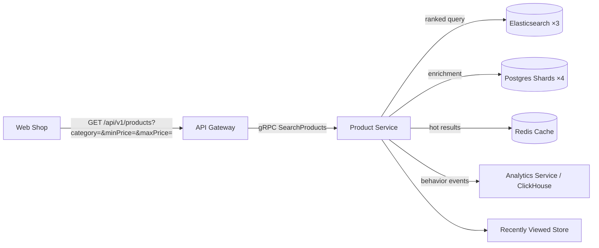
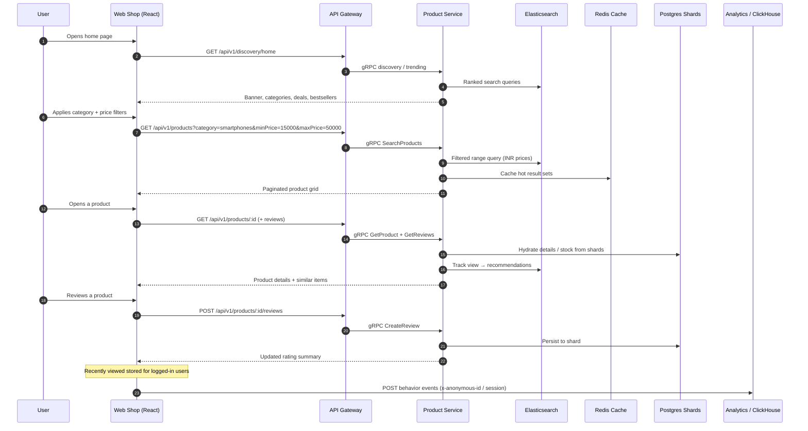

# 🛍️ Catalog Browsing & Discovery Flow

How a visitor discovers products — from the home banner through search, filtering, product details, and reviews — all served by the Product Service backed by **Elasticsearch** and **PostgreSQL shards**.

## 🖼️ Screens

| | |
| :--- | :--- |
| **🏠 Home / Banner & Navbar** | **🛍️ All Products (with filters)** |
|  |  |
| **📦 Product Details** | **⭐ Product Reviews** |
|  |  |
| **🛒 Cart** | |
|  | |

## 🧭 Discovery Path

## 🔄 Sequence Diagram

## 🔍 Search & Filtering Details

- **Range filters** operate on **INR prices** stored in Elasticsearch (`price`, `currency` fields), so `minPrice`/`maxPrice` match the displayed catalog values.
- **Faceted categories** are aggregated at query time from the ES index.
- **Recommendations & "frequently bought"** are driven by behavior events (anonymous id / session id) streamed into the analytics service.
- **Reviews** are written to the owning product shard and aggregated into an ES-routed rating summary for instant display.

---

[🔗 View Checkout Flow](./checkout-flow.md) | [🔗 View Order Tracking Flow](./track-order-flow.md) | [⬅️ Back to Flows Index](./README.md)
