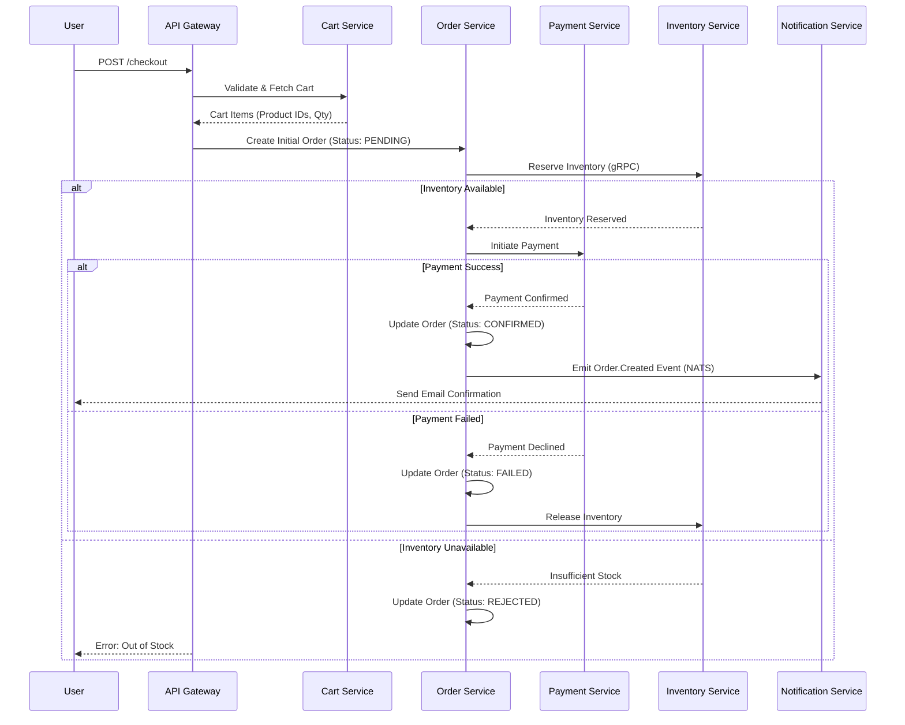

# 🌊 Checkout Flow

The checkout flow is a critical multi-service orchestration that transforms a shopping cart into a confirmed order.

## 🔄 Sequence Diagram

## 🛠️ Services Involved

1.  **[API Gateway](../services/api-gateway.md)**: Entry point and orchestrator.
2.  **[Cart Service](../services/cart-service.md)**: Provides the source of truth for items being purchased.
3.  **[Order Service](../services/order-service.md)**: Manages the lifecycle and state transitions.
4.  **[Inventory Service](../services/inventory-service.md)**: Handles synchronous stock reservations.
5.  **[Payment Service](../services/payment-service.md)**: Processes financial transactions.
6.  **[Notification Service](../services/notification-service.md)**: Sends asynchronous confirmations.

---

[🔗 View Order Processing Flow](./order-processing-flow.md) | [⬅️ Back to Flows Index](./README.md)
