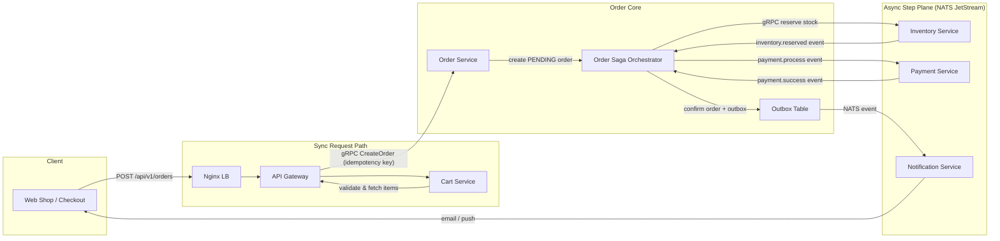
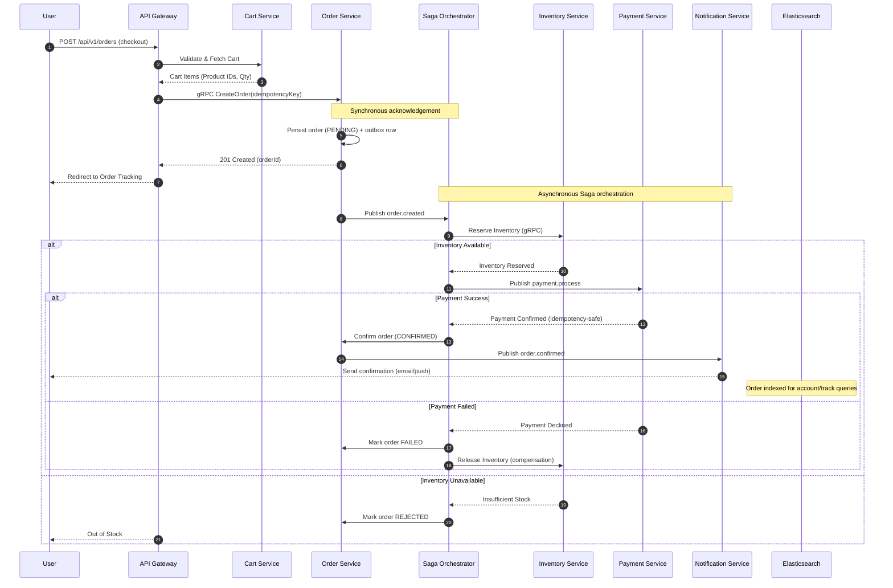

# 🌊 Checkout Flow

The checkout flow is a critical multi-service orchestration that transforms a shopping cart into a confirmed order. It combines a **synchronous request path** (via the API Gateway) with an **asynchronous Saga orchestration** over NATS JetStream, protected by idempotency keys and the outbox pattern.

## 🧭 Flow at a Glance

## 🔄 Sequence Diagram

## 🛠️ Services Involved

1.  **[API Gateway](../services/api-gateway.md)**: Single entry point, JWT guard, gRPC client.
2.  **[Cart Service](../services/cart-service.md)**: Source of truth for items being purchased.
3.  **[Order Service](../services/order-service.md)**: Owns the order lifecycle and outbox.
4.  **[Inventory Service](../services/inventory-service.md)**: Synchronous stock reservations.
5.  **[Payment Service](../services/payment-service.md)**: Idempotent financial transactions.
6.  **[Notification Service](../services/notification-service.md)**: Asynchronous confirmations via NATS.

## 🛡️ Reliability Guarantees

- **Exactly-once payment**: Idempotency keys (Redis) deduplicate payment events.
- **At-least-once delivery**: NATS JetStream persists events; consumers are idempotent.
- **Outbox pattern**: Order events are committed with the order in the same DB transaction, so no event is lost between DB commit and NATS publish.

---

[🔗 View Order Tracking Flow](./track-order-flow.md) | [🔗 View Catalog Browsing Flow](./catalog-browsing-flow.md) | [⬅️ Back to Flows Index](./README.md)
