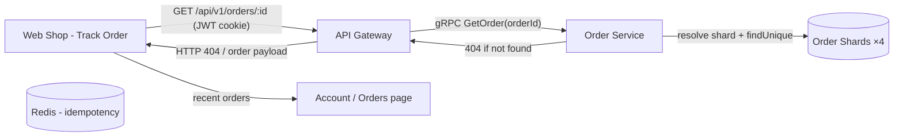
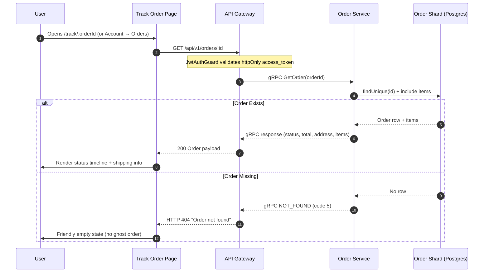

# 📦 Order Tracking Flow

After checkout, users track their order on the **Track Order** page. The page queries the **Order Service** through the API Gateway using the user's JWT session — and correctly surfaces a **404 "Order not found"** when an id is missing or belongs to another user.

## 🧭 Tracking Path

## 🔄 Sequence Diagram

## 🐛 Why No "Ghost Orders"?

The `GetOrder` gRPC handler **throws** `RpcException({ code: 5, message: 'Order <id> not found' })` when the id does not exist. The API Gateway maps gRPC code `5` (NOT_FOUND) to **HTTP 404**, and the storefront renders a clean "Order not found" empty state instead of a fabricated blank order.

| Old behavior (bug)        | New behavior (fixed)                                  |
| :------------------------ | :---------------------------------------------------- |
| Returned empty order object → misleading UI | Throws gRPC `NOT_FOUND` → HTTP 404 → clear empty state |

## 🔗 Related

- **[Account page](../../apps/web-shop/README.md)**: order history, addresses, saved cards, recently viewed.
- **[Checkout Flow](./checkout-flow.md)**: how orders are created.

---

[🔗 View Checkout Flow](./checkout-flow.md) | [🔗 View Catalog Browsing Flow](./catalog-browsing-flow.md) | [⬅️ Back to Flows Index](./README.md)
