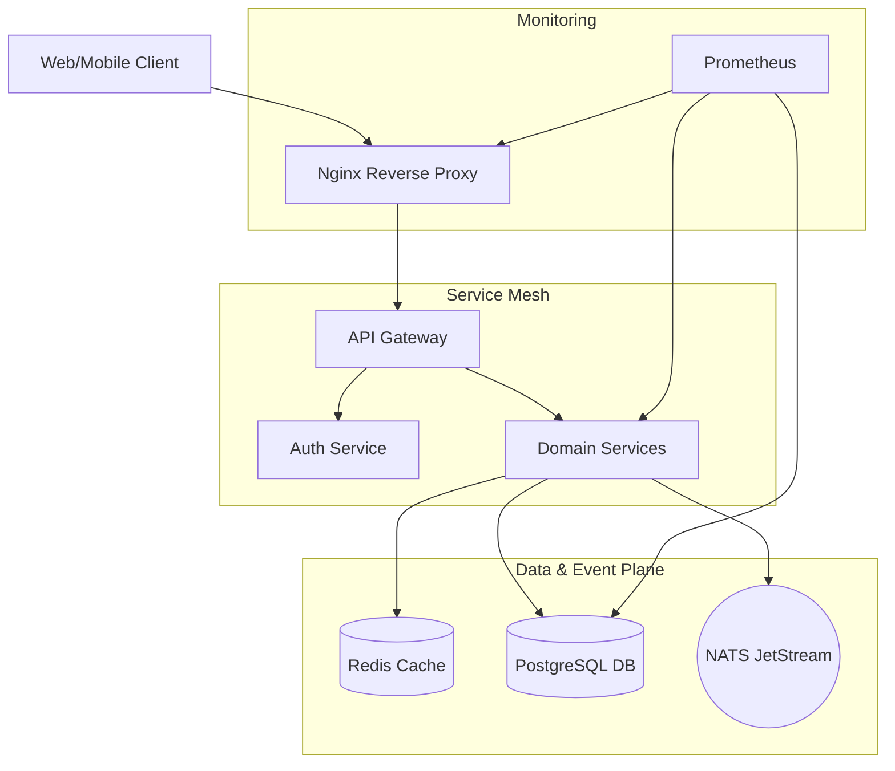

# 🏗️ Infrastructure Architecture

This section documents the foundational components that power the E-Commerce Microservices Platform.

## 📖 Key Components

- **[Docker Setup](./docker-setup.md)** - Containerization and orchestration strategy.
- **[Nginx Reverse Proxy](./nginx.md)** - Ingress management and load balancing.
- **[NATS Messaging](./nats.md)** - High-performance event-driven communication.
- **[PostgreSQL](./postgres.md)** - Relational data persistence with Prisma.
- **[Redis](./redis.md)** - Distributed caching and session management.
- **[Scaling & Sharding](./scaling-and-sharding.md)** - Horizontal database partitioning and read/write splitting.
- **[Scripts & Tooling](./scripts-and-tooling.md)** - PGP key generation, database seeding, and setup automation.
- **[Observability](./observability.md)** - Prometheus, Grafana, and structured logging.

---

## 🌊 Infrastructure Flow

The following diagram illustrates how infrastructure components interact to handle a client request:

---

[⬅️ Back to Home](../../README.md)
