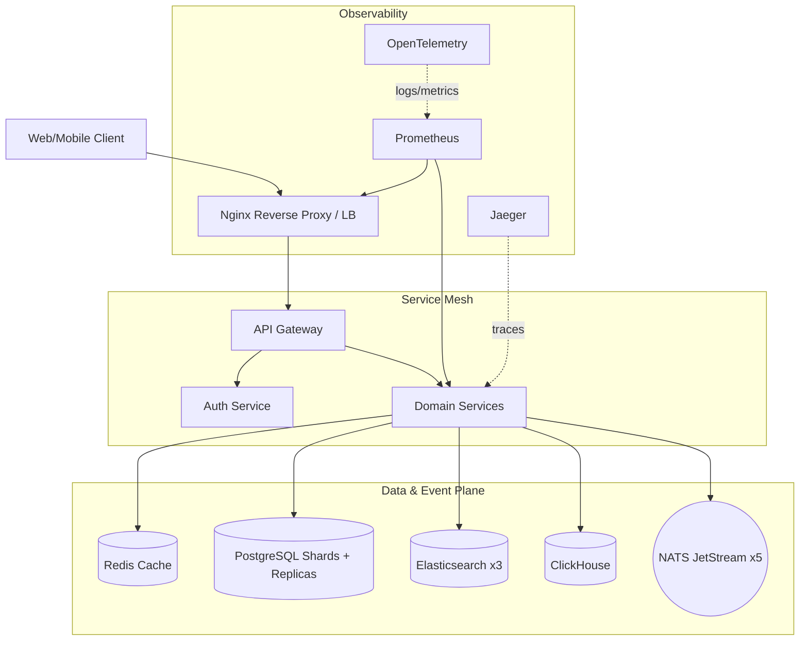

# 🏗️ Infrastructure Architecture

This section documents the foundational components that power the E-Commerce Microservices Platform.

## 📖 Key Components

- **[Getting Started](./getting-started.md)** - Prerequisites, `./setup.sh`, running the stack, and the AWS/Floci deploy paths.
- **[Docker Setup](./docker-setup.md)** - Containerization and orchestration strategy (up to 63 containers).
- **[AWS & Floci](./aws-and-floci.md)** - Local AWS emulation for dev + real AWS deployment (Terraform EKS) with multi-cloud portability.
- **[Nginx Reverse Proxy](./nginx.md)** - Ingress management and load balancing.
- **[NATS Messaging](./nats.md)** - High-performance event-driven communication (5-node JetStream cluster).
- **[Scaling & Sharding](./scaling-and-sharding.md)** - Horizontal database partitioning (product ×4, order ×4) and read/write splitting.
- **Data Plane**: PostgreSQL + pgBouncer, Redis, Elasticsearch (×3), ClickHouse.
- **[Scripts & Tooling](./scripts-and-tooling.md)** - PGP key generation, database seeding, and setup automation.
- **[Observability](./observability.md)** - Prometheus, Grafana, Jaeger, OpenTelemetry.

---

## 🌊 Infrastructure Flow

The following diagram illustrates how infrastructure components interact to handle a client request:

---

[⬅️ Back to Home](../../README.md)
