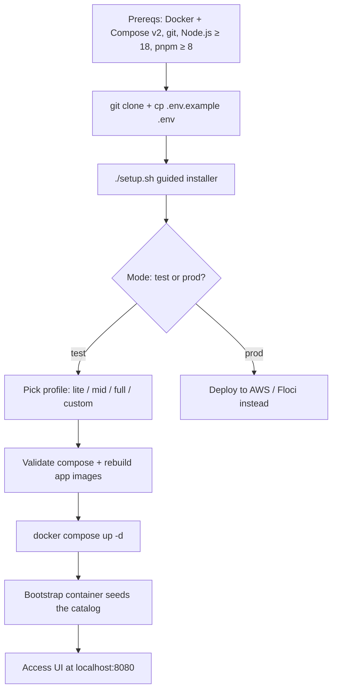

# 🚀 Getting Started — Setup, Run & Deploy

This guide takes you from a clean machine to a running Skyline Shop stack — and then to AWS. The whole platform is containerized (63 containers on the full profile), so the only real prerequisites are Docker and a recent Node.js for local dev tooling.

## Setup flow at a glance



---

## 0. Prerequisites

| Tool                     | Version             | Why                                                      |
| :----------------------- | :------------------ | :------------------------------------------------------- |
| **Docker** + Compose v2  | any recent          | Runs the entire stack (`docker compose` plugin required) |
| **git**                  | any                 | Clone + repo tooling                                     |
| **Node.js** + **pnpm**   | Node ≥ 18, pnpm ≥ 8 | Local dev / scripts (optional for pure Docker run)       |
| **Terraform** (optional) | ≥ 1.5               | Real AWS provisioning                                    |

Install checks are performed by `./setup.sh` automatically (it can even start the Docker daemon for you).

---

## 1. One-command interactive setup

```bash
git clone <repo-url> skyline-shop
cd skyline-shop-commerceos-microservices
cp .env.example .env        # setup.sh does this for you if missing

./setup.sh
```

`setup.sh` is the **guided installer**. It asks three questions:

1. **Mode** — `test` (run locally with Docker Compose) or `prod` (deploy to AWS / Floci).
2. **Profile** — how big a stack you want:

| Profile  | Containers | Contents                                                                                                         |
| :------- | :--------- | :--------------------------------------------------------------------------------------------------------------- |
| `lite`   | ~14        | No shards/replicas/ES/observability — for low-end devices. 1,000 products.                                       |
| `mid`    | ~38        | Balanced dev stack: shards + replicas, single-node ES + Kibana, pgAdmin, RedisInsight, nginx LB. 5,000 products. |
| `full`   | 63         | Everything (identical to `docker compose up -d`). 10,000 products, full observability.                           |
| `custom` | you pick   | Choose shard counts, replicas, ES nodes, NATS nodes, PgBouncer, nginx, GUIs, observability, seed count.          |

3. **Postgres password** — keep default `password` (dev) or set your own.

The script then: validates the compose file → tears down any previous stack → **rebuilds app images** (baking in your latest code) → starts containers → waits for readiness → prints a status box with every URL.

> Flags: `./setup.sh --dry-run` prints the plan without touching containers, `./setup.sh --volumes` also wipes named volumes when tearing down the old stack, `./setup.sh --help` for usage.

---

## 2. Starting & stopping

If you already ran setup (or want the full stack directly):

```bash
docker compose up -d                                # full stack (63 containers)
docker compose down                                 # stop
docker compose down -v                              # stop + wipe data volumes
```

For a previously-generated profile:

```bash
docker compose -f .setup/docker-compose.yml up -d   # lite / mid / custom stack
```

### Seeding data

The `bootstrap` container seeds the catalog automatically on startup. To re-seed after changing the seed logic:

```bash
docker compose restart bootstrap
docker compose logs -f bootstrap
```

Manual seed scripts (also used in CI):

```bash
pnpm seed:db       # products/categories into Postgres shards
pnpm seed:es       # index products into Elasticsearch
pnpm seed:api      # full pipeline through the API
pnpm seed:verify   # checks seed consistency across stores
```

---

## 3. Where everything lives

### URLs after a `full` stack boots

| Service              | URL                                       |
| :------------------- | :---------------------------------------- |
| Web shop (UI)        | http://localhost:8080                     |
| API gateway (health) | http://localhost:3000/api/v1/health       |
| Swagger docs         | http://localhost:3000/api/v1/docs         |
| Kibana               | http://localhost:5601                     |
| pgAdmin              | http://localhost:5050 (admin@skyline.dev) |
| RedisInsight         | http://localhost:8001                     |
| Jaeger (traces)      | http://localhost:16686                    |
| Prometheus           | http://localhost:9090                     |
| Grafana              | http://localhost:3100 (admin/admin)       |
| NATS                 | nats://localhost:4222                     |
| Postgres (master)    | localhost:5435 (root / password)          |

### Test account

Register any account through the UI (`http://localhost:8080`), or use the seeded demo flow — login/register hit `POST /api/v1/auth/register` and `POST /api/v1/auth/login`, which set `access_token` / `refresh_token` httpOnly cookies.

### Verify the stack

```bash
curl http://localhost:3000/api/v1/health
curl "http://localhost:3000/api/v1/products?category=smartphones&minPrice=15000&maxPrice=50000"
curl http://localhost:3000/api/v1/orders/<some-id>   # 404 for unknown orders
```

---

## 4. Local development (hot reload)

If you prefer running services on the host instead of containers:

```bash
pnpm install
pnpm build                     # one-time build of all apps
pnpm start:auth                # or start:order / product / cart / inventory / payment / analytics
pnpm start:all                 # every app via concurrently
```

Quality gates:

```bash
pnpm lint
pnpm test
pnpm db:migrate:local          # run Prisma migrations against local shards
```

---

## 5. Deploy to AWS — or test AWS locally with Floci

The platform is **cloud-portable** (plain Kubernetes + ArgoCD), so you never touch an AWS account to develop. Two paths:

### A. Local AWS emulation with Floci (free, no account) — recommended first

Floci is a dev-only emulator (part of the repo) exposing **69 AWS services at `localhost:4566`** — S3, DynamoDB, SQS/SNS, Secrets Manager, SSM, IAM/STS, plus Docker-backed Lambda/RDS/EKS/EC2. You run the **exact same AWS commands** you'd use in production.

```bash
pnpm floci:up                  # start emulator + UI, seed demo resources, open console
./scripts/floci-aws.sh s3 mb s3://my-bucket            # AWS CLI via bundled compat image
./scripts/use-env.sh local     # point the app at localhost:4566 (edits .env only)

pnpm deploy:floci              # full pipeline against the Floci k3s cluster
```

Full reference: [AWS Deployment & Local AWS Emulation (Floci)](./aws-and-floci.md).

### B. Real AWS deployment

Terraform IaC in `infrastructure/aws` provisions VPC, EKS, IAM (CI/CD + per-service IRSA roles), ECR, S3, ArgoCD, and optional managed RDS / ElastiCache / OpenSearch. The app stays unchanged — only the data-plane endpoints switch via environment ConfigMaps.

```bash
./scripts/use-env.sh aws       # clear endpoint override (real AWS mode)
cd infrastructure/aws
cp terraform.tfvars.example terraform.tfvars
terraform init && terraform plan && terraform apply -auto-approve
pnpm deploy:aws                # push to ECR, ArgoCD syncs k8s/overlays/production
```

> ⚠️ Real AWS incurs cost — the setup script and Terraform will both warn you.

**Switching is one command** (`./scripts/use-env.sh local|aws`); only five `AWS_*` env vars drive the mode. See [aws-and-floci.md](./aws-and-floci.md) for the complete matrix and multi-cloud portability notes.

---

## 6. Troubleshooting

| Symptom                      | Fix                                                                                                                                                     |
| :--------------------------- | :------------------------------------------------------------------------------------------------------------------------------------------------------ |
| Setup hangs on readiness     | `docker compose logs -f bootstrap` — check the bootstrap exit code                                                                                      |
| Elasticsearch unhealthy      | Give the 3-node cluster time to form (green = all nodes); restart all 3 together: `docker compose restart elasticsearch1 elasticsearch2 elasticsearch3` |
| Stale data / wrong results   | `docker compose down -v && docker compose up -d` then let bootstrap re-seed                                                                             |
| Port already in use          | Change the host mapping in the compose file, or pick `lite` profile                                                                                     |
| Products missing from search | `pnpm seed:es` to re-index, or `docker compose restart bootstrap`                                                                                       |
| Old images                   | `./setup.sh` rebuilds app images; or `docker compose build <service>`                                                                                   |

---

## 📚 Related

- [Docker Setup](./docker-setup.md) — the container orchestration itself.
- [AWS Deployment & Local AWS Emulation (Floci)](./aws-and-floci.md) — the full AWS guide.
- [Database Architecture](../architecture/database-architecture.md) — what the stack boots.
- [Algorithms & Data Structures](../architecture/algorithms.md) — how features work.
- [Setup Script source](../../setup.sh) — the installer behind Section 1.

[⬅️ Back to Infrastructure Index](./README.md) · [⬅️ Back to Home](../../README.md)
