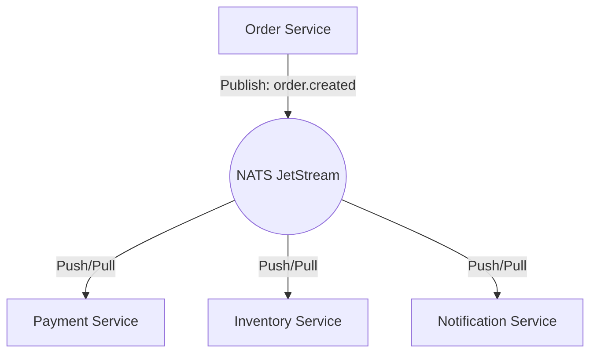

# 🛰️ NATS Messaging

## 📝 Overview

NATS JetStream is the nervous system of our platform, enabling asynchronous, event-driven communication between decoupled services.

## 🏗️ Why NATS?

1.  **High Throughput**: Capable of handling millions of messages per second.
2.  **JetStream Persistence**: Provides "at-least-once" delivery guarantees and message replay capabilities.
3.  **Loose Coupling**: Services don't need to know about each other; they only care about subjects/events.
4.  **Lightweight**: Extremely low resource footprint compared to Kafka or RabbitMQ.

## 🔄 Event Flow (Pub/Sub)

---

[⬅️ Back to Infrastructure Index](./README.md)
