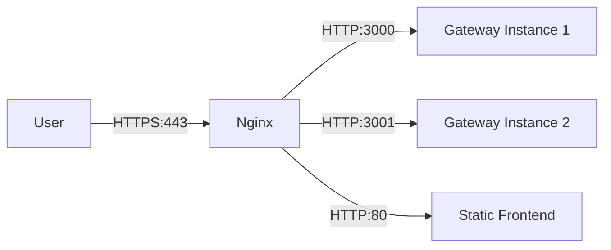

# 🟢 Nginx Reverse Proxy

## 📝 Overview

Nginx acts as the primary entry point (Ingress) for the platform, providing a secure and scalable way to expose our microservices.

## 🏗️ Why Nginx?

1.  **SSL Termination**: Centralized management of TLS certificates.
2.  **Load Balancing**: Distributing traffic across multiple instances of the API Gateway.
3.  **Static Content**: Serving the frontend assets efficiently.
4.  **Security**: Shielding internal service ports from the public internet.

## 🔄 Request Flow

---

[⬅️ Back to Infrastructure Index](./README.md)
