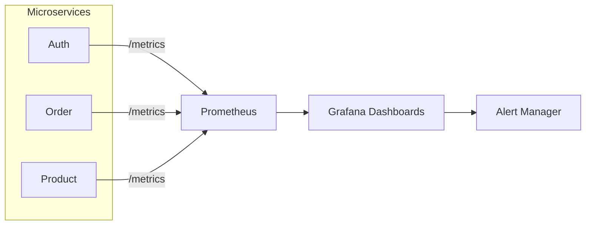
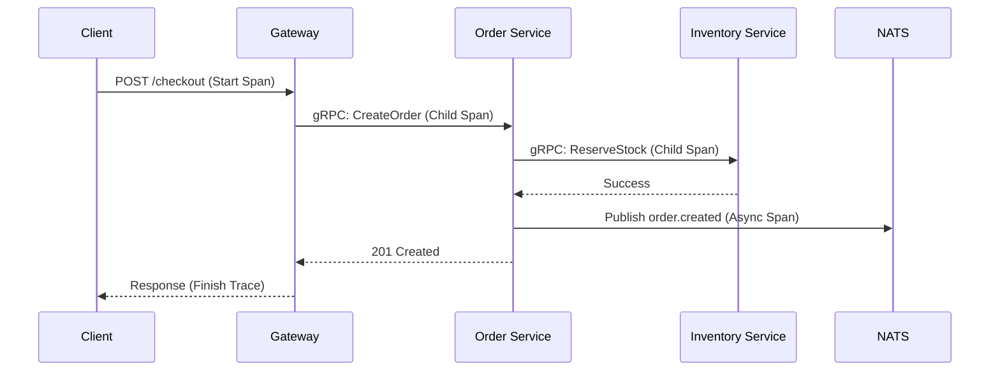

# 📈 Observability & Monitoring Strategy

The E-Commerce Microservices Platform implements a comprehensive observability stack based on the **Three Pillars of Observability**: Metrics, Logging, and Tracing.

<div align="center">
  [](#)
  [](#)
  [](#)
</div>

---

## 📊 1. Metrics (Prometheus & Grafana)

We collect real-time telemetry from all microservices to monitor system health and performance.

### Key Performance Indicators (KPIs)

| Metric Type    | Example                         | Purpose                                              |
| :------------- | :------------------------------ | :--------------------------------------------------- |
| **Throughput** | `http_requests_total`           | Monitor traffic volume across the API Gateway.       |
| **Latency**    | `http_request_duration_seconds` | Track P95/P99 response times for critical endpoints. |
| **Errors**     | `http_request_errors_total`     | Alert on spikes in 5xx status codes.                 |
| **Resources**  | `process_cpu_seconds_total`     | Monitor container resource saturation.               |

### Metrics Collection Flow



---

## 📝 2. Structured Logging

We use a unified logging strategy across all services to enable efficient debugging and log aggregation.

### Logging Standards

- **Format**: Structured JSON for machine readability.
- **Correlation IDs**: Every request is assigned a `x-correlation-id` at the API Gateway, which is propagated across all downstream services.
- **Context**: Every log entry includes `service_name`, `timestamp`, `level`, and `correlation_id`.

### Example Log Entry

```json
{
  "level": "info",
  "message": "Order created successfully",
  "service": "order-service",
  "correlation_id": "a1b2c3d4-e5f6-g7h8",
  "order_id": "ORD-12345",
  "timestamp": "2026-05-10T12:00:00Z"
}
```

---

## 🔍 3. Distributed Tracing (Roadmap)

To visualize request lifecycles across service boundaries, we are integrating **OpenTelemetry** with **Jaeger**.

### Target Tracing Flow



---

## 🛠️ Dashboard Configuration

- **Grafana**: Accessible at `http://localhost:3001` (in dev).
- **Dashboards**: Pre-configured dashboards for NestJS internals, NATS throughput, and Database performance.

---

[⬅️ Back to Home](../../README.md)
