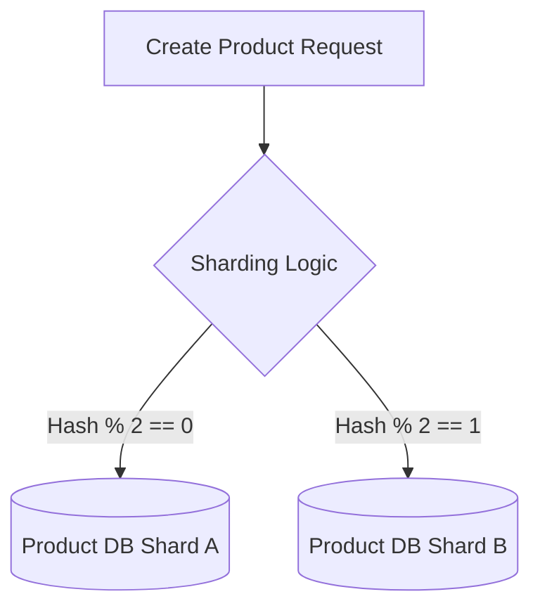
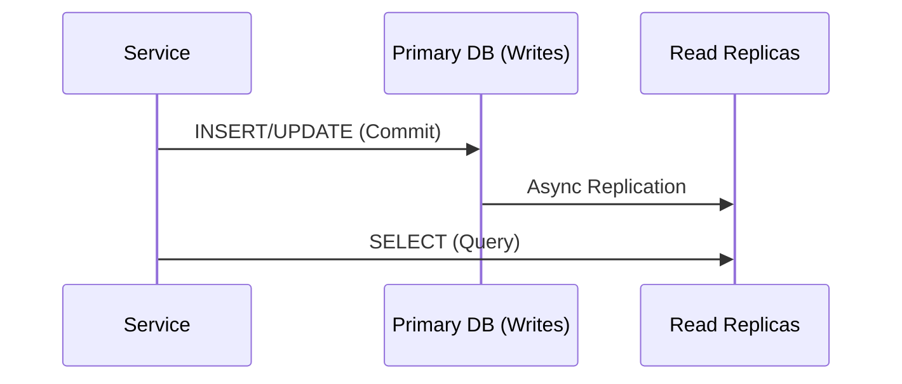
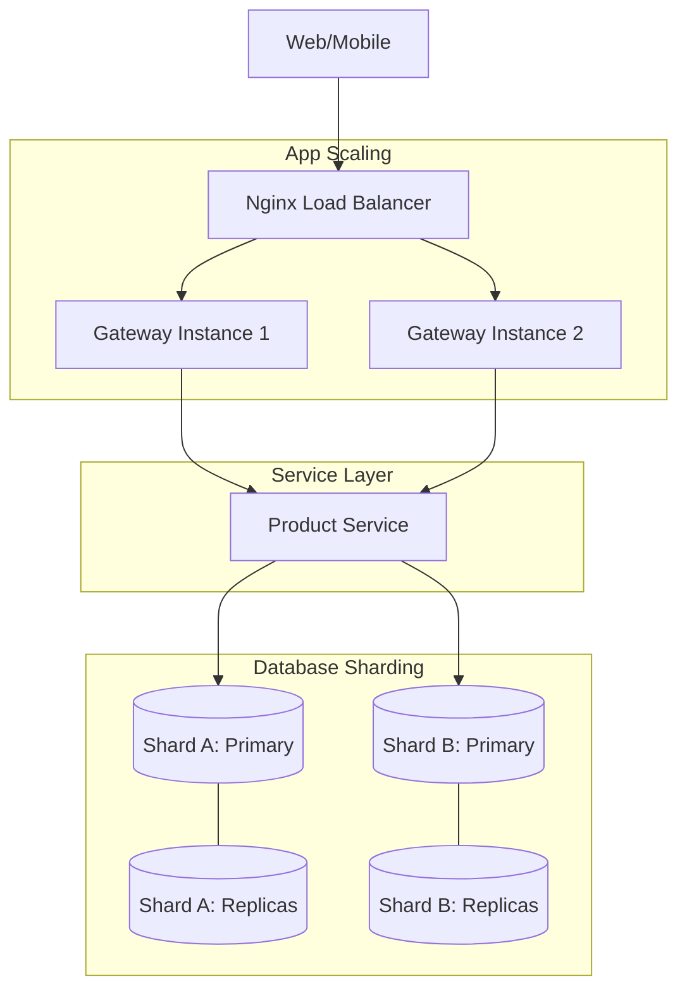

# 📈 Scaling & Database Strategy

This document explains how the E-Commerce Microservices Platform handles high-volume traffic and massive data growth through advanced database patterns.

## 🏗️ Scaling Overview

| Pattern                  | Focus             | Implementation                                                                  |
| :----------------------- | :---------------- | :------------------------------------------------------------------------------ |
| **Horizontal Scaling**   | Application Layer | Stateless services in Docker containers (scale via Nginx/Docker).               |
| **Database Sharding**    | Data Layer        | Partitioning data across multiple physical databases (e.g., `product-service`). |
| **Read/Write Splitting** | Performance       | Directing writes to Primary and reads to Replicas.                              |
| **Caching Strategy**     | Latency           | Distributed Redis layer for high-frequency transient data (Carts/Sessions).     |

---

## 🧩 Database Sharding (Horizontal Partitioning)

In the `product-service`, we implement **Application-Level Sharding** to distribute millions of products across multiple database instances.

### Sharding Logic

We use a **Key-Based Sharding** strategy. The `sku` or `id` of a product is hashed to determine its target shard.



### Implementation Example (`product-service.service.ts`)

```typescript
private getShard(key: string): PrismaClient {
  const hash = key.split('').reduce((acc, char) => acc + char.charCodeAt(0), 0);
  return hash % 2 === 0 ? this.primaryShard : this.shardB;
}
```

---

## âš¡ Read/Write Splitting (CQRS Lite)

To optimize performance, we separate heavy write operations from high-frequency read operations.

### Workflow

1.  **Writes**: Sent to the **Primary Database**.
2.  **Reads**: Distributed across **Read Replicas** using a Round-Robin or Load-Balanced approach.



---

## 🌊 Scaling Flowchart

The following diagram illustrates how the system scales from the Ingress layer down to the Shards:



---

## 🛠️ Infrastructure Configuration (`docker-compose.yml`)

We define multiple database containers to simulate a sharded environment:

- `product_db`: Shard A (Primary)
- `product_db_shard_b`: Shard B (Primary)
- Future expansion: `product_db_replica_1`, `product_db_replica_2`.

---

## 📈 Scalability Checklist

- [x] Stateless application logic for horizontal container scaling.
- [x] Application-level sharding logic in high-growth services.
- [x] Distributed event bus (NATS) for decoupled async processing.
- [x] Redis layer for offloading DB read pressure on ephemeral data.

---

[⬅️ Back to Architecture Index](../architecture/README.md)
