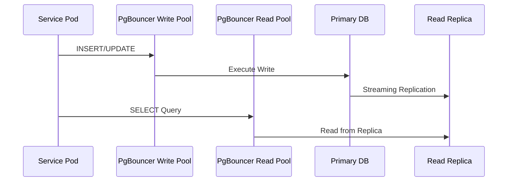

# Scaling & Database Strategy

This document explains how the E-Commerce Microservices Platform handles **30M+ daily throughput** with **sub-50ms p99 latency** through advanced database patterns and horizontal scaling.

## Scaling Overview

| Pattern | Focus | Implementation |
| :--- | :--- | :--- |
| **Horizontal Scaling** | Application Layer | Stateless services with HPA (CPU/memory), 20-25 pods per service |
| **Database Sharding** | Data Layer | 2-4 shards per service, key-based hashing |
| **Read/Write Splitting** | Performance | PgBouncer transaction pooling, replica read pools |
| **Caching Strategy** | Latency | Redis cluster (6+6 nodes), allkeys-lru eviction |
| **Search Offloading** | Query Performance | Elasticsearch 6-node cluster, dedicated coordinator |
| **Connection Pooling** | DB Efficiency | Per-shard PgBouncer with transaction mode pooling |

---

## Architecture Overview

```mermaid
graph TB
    subgraph "Edge & Application Layer"
        Client[Web/Mobile Client]
        CDN[Cloudflare CDN / WAF]
        Nginx[Nginx Load Balancer<br/>Active-Active x 2]
        GW[API Gateway<br/>20 Pods<br/>HPA: CPU>70%]
    end

    subgraph "Services Layer"
        Auth[Auth Service<br/>10 Pods<br/>HPA: CPU>70%]
        Product[Product Service<br/>25 Pods<br/>HPA: CPU>70%]
        Order[Order Service<br/>25 Pods<br/>HPA: CPU>70%]
    end

    subgraph "PgBouncer per Shard - Connection Pooling"
        subgraph "Auth Shards"
            PB_A0_W["Auth S0<br/>Write Pool"]
            PB_A0_R["Auth S0<br/>Read Pool"]
            PB_A1_W["Auth S1<br/>Write Pool"]
            PB_A1_R["Auth S1<br/>Read Pool"]
        end
        subgraph "Order Shards (4)"
            PB_O0_W["Order S0 Write"]
            PB_O0_R["Order S0 Read"]
            PB_O1_W["Order S1 Write"]
            PB_O1_R["Order S1 Read"]
            PB_O2_W["Order S2 Write"]
            PB_O2_R["Order S2 Read"]
            PB_O3_W["Order S3 Write"]
            PB_O3_R["Order S3 Read"]
        end
        subgraph "Product Shards (4)"
            PB_P0_W["Prod S0 Write"]
            PB_P0_R["Prod S0 Read"]
            PB_P1_W["Prod S1 Write"]
            PB_P1_R["Prod S1 Read"]
            PB_P2_W["Prod S2 Write"]
            PB_P2_R["Prod S2 Read"]
            PB_P3_W["Prod S3 Write"]
            PB_P3_R["Prod S3 Read"]
        end
    end

    subgraph "Database Layer - Sharded Clusters"
        subgraph "Auth DB Clusters (2)"
            Auth_Primary0["Auth S0 Primary"]
            Auth_Replica0["Auth S0 Replica"]
            Auth_Primary1["Auth S1 Primary"]
            Auth_Replica1["Auth S1 Replica"]
        end
        subgraph "Order DB Clusters (4)"
            O0["S0 Pri + Rep"]
            O1["S1 Pri + Rep"]
            O2["S2 Pri + Rep"]
            O3["S3 Pri + Rep"]
        end
        subgraph "Product DB Clusters (4)"
            P0["S0 Pri + Rep"]
            P1["S1 Pri + Rep"]
            P2["S2 Pri + Rep"]
            P3["S3 Pri + Rep"]
        end
    end

    subgraph "Replication Streaming"
        Auth_Primary0 -->|Streaming| Auth_Replica0
        Auth_Primary1 -->|Streaming| Auth_Replica1
    end

    subgraph "Cache Layer"
        Redis[Redis Cluster<br/>6 Masters + 6 Replicas]
    end

    subgraph "Search & Messaging"
        ES[Elasticsearch<br/>6 Nodes<br/>6 shards + 2 replicas]
        NATS[NATS Cluster<br/>5 Nodes<br/>JetStream Enabled]
    end

    %% Flows
    Client --> CDN --> Nginx --> GW
    GW --> Auth & Product & Order

    %% Auth -> PgBouncer -> DB
    Auth ==> PB_A0_W & PB_A0_R & PB_A1_W & PB_A1_R
    PB_A0_W ==> Auth_Primary0
    PB_A0_R ==> Auth_Replica0
    PB_A1_W ==> Auth_Primary1

    %% Order -> PgBouncer -> DB
    Order ==> PB_O0_W & PB_O0_R & PB_O1_W & PB_O1_R & PB_O2_W & PB_O2_R & PB_O3_W & PB_O3_R
    PB_O0_W ==> O0; PB_O0_R ==> O0
    PB_O1_W ==> O1; PB_O1_R ==> O1
    PB_O2_W ==> O2; PB_O2_R ==> O2
    PB_O3_W ==> O3; PB_O3_R ==> O3

    %% Product -> PgBouncer -> DB
    Product ==> PB_P0_W & PB_P0_R & PB_P1_W & PB_P1_R & PB_P2_W & PB_P2_R & PB_P3_W & PB_P3_R
    PB_P0_W ==> P0; PB_P0_R ==> P0
    PB_P1_W ==> P1; PB_P1_R ==> P1
    PB_P2_W ==> P2; PB_P2_R ==> P2
    PB_P3_W ==> P3; PB_P3_R ==> P3

    %% Cache & Search
    Auth & Product & Order --> Redis
    Product --> ES
    Auth & Product & Order --> NATS
```



---

## Database Sharding (Horizontal Partitioning)

We implement **Application-Level Sharding** using key-based hashing across all data services.

### Shard Distribution

| Service | Shards | Shard Key | Read Replicas per Shard |
| :--- | :--- | :--- | :--- |
| Auth | 2 | `user_id % 2` | 1 |
| Order | 4 | `user_id % 4` | 1 |
| Product | 4 | `sku hash % 4` | 1 |

### Sharding Logic (product-service)

```typescript
// DatabaseService manages shard connections automatically
const shard = this.prisma.getShard(data.sku || 'default');
return shard.product.create({ data });
```

The `DatabaseService` discovers shards from environment variables (`{SERVICE}_S{N}_DATABASE_WRITE_URL` / `_READ_URL`) and maintains a map of `PrismaClient` instances per shard.

---

## PgBouncer Connection Pooling

Each database shard has **dedicated PgBouncer deployments** (2 replicas each) with transaction-mode pooling:

| Pool | Mode | `default_pool_size` | `max_client_conn` |
| :--- | :--- | :--- | :--- |
| Write Pool | transaction | 25-30 | 2000 |
| Read Pool | transaction | 25-30 | 2000 |

PgBouncer configuration per shard:
```ini
[databases]
products = host=postgres-product-s0 port=5432 dbname=products
products_ro = host=postgres-product-s0-replica port=5432 dbname=products

[pgbouncer]
pool_mode = transaction
default_pool_size = 30
max_client_conn = 2000
server_reset_query = DISCARD ALL
```

---

## Read/Write Splitting (CQRS Lite)



Implementation in `DatabaseService`:
- `this.prisma` (primary client) handles writes
- `this.prisma.$replica` (replica client) handles reads
- Per-shard: `shard.client` for writes, `shard.replica` for reads

---

## Throughput Math (30M daily)

| Layer | Pods | Per-Pod TPS | Total TPS | Daily Capacity |
| :--- | :--- | :--- | :--- | :--- |
| API Gateway | 20 | 1,500 | 30,000 | 2.6B |
| Auth Service | 10 | 7,000 | 70,000 | 6B |
| Product Service | 25 | 7,000 | 175,000 | 15B |
| Order Service | 25 | 7,000 | 175,000 | 15B |

**Sustained 30M/day = ~347 TPS average** (well within capacity).

---

## Scalability Checklist

- [x] Stateless application logic for horizontal container scaling (HPA)
- [x] Per-service database sharding (2-4 shards) with key-based routing
- [x] PgBouncer per shard with read/write pool separation
- [x] Streaming replication to read replicas
- [x] Distributed event bus (NATS 5-node cluster with JetStream)
- [x] Redis cluster (6+6 nodes) for offloading DB read pressure
- [x] Elasticsearch (6-node, 6 shards, 2 replicas) for search offloading
- [x] PodDisruptionBudgets for zero-downtime rolling updates
- [x] gRPC transport for low-latency inter-service calls
- [x] OpenTelemetry tracing for bottleneck identification

---

[Back to Architecture Index](../architecture/README.md)
