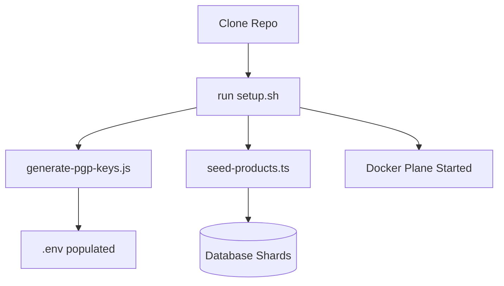

# 🛠️ Platform Scripts & Tooling

This section documents the utility scripts and extra tools used to manage, secure, and bootstrap the E-Commerce Microservices Platform.

## 🚀 Deploy — one command (`scripts/deploy.sh`)

The whole platform deploys with a single script — to the local Floci emulator or to real AWS:

```bash
./scripts/deploy.sh floci     # full deploy on the local Floci emulator (default)
./scripts/deploy.sh aws       # full deploy on real AWS (ECR + EKS/ArgoCD)
```

The pipeline is identical for both targets: switch the AWS mode → (floci) start & seed the emulator → resolve secrets from **AWS Secrets Manager** → build & push images → render & apply the Kubernetes manifests.

`scripts/README.md` is the full index of every script with a one-line explanation. Highlights:

- **`scripts/floci-seed.sh`** — idempotent seed of the Floci emulator (S3, SQS/SNS, DynamoDB, Secrets Manager incl. `app-secrets`, ECR, EKS, RDS).
- **`scripts/floci-deploy.sh`** — renders `k8s/base` (secrets injected) and applies a 1-replica overlay to the Floci k3s cluster.
- **`scripts/use-env.sh`** — switches `.env` between local Floci and real AWS (`local` / `aws` / `status`).
- **`scripts/floci-aws.sh`** — AWS CLI inside the emulator container (no host AWS CLI or account needed).

## 🔑 Secrets handling

- `k8s/base/secrets.yml` is a **dev-only fallback** (placeholders, readable via `stringData`).
- Real JWT/DB secrets are stored in AWS Secrets Manager (`<project>/<env>/app-secrets`), seeded with random values by `floci-seed.sh`.
- `deploy.sh` materializes the rendered `Secret` from Secrets Manager at deploy time — **no secrets are committed to git**.
- On real AWS the IRSA roles in `infrastructure/aws/iam.tf` already permit `secretsmanager:GetSecretValue`, the same read path used here.

---

## 🗝️ PGP Key Generation (`generate-pgp-keys.js`)

### Why do we use this?

In a zero-trust architecture, sensitive payloads (like payment details or private user data) should be encrypted even when traveling over internal networks. We use **OpenPGP** to provide:

1.  **Encryption**: Ensuring only the intended service can read the data.
2.  **Digital Signatures**: Verifying that the data was actually sent by the claimed source service.

### What it does:

- Generates a 2048-bit RSA key pair.
- Automatically formats and injects these keys into your `.env` file.
- Provides a consistent identity for the platform's internal communications.

---

## 🌱 Product Seeding (`scripts/seed-products.ts`)

### Why do we use this?

A microservices system is difficult to visualize without data. This script provides a production-like catalog to test:

1.  **Sharding Logic**: Distributed products across multiple database shards.
2.  **Search Performance**: Testing high-frequency reads against the Product Service.
3.  **UI/UX**: Providing realistic content for the frontend.

---

## 🏗️ Automated Setup (`setup.sh`)

### Why do we use this?

Microservices are complex to bootstrap. This script automates the developer experience by:

1.  **Prerequisite Checks**: Ensuring Docker, Node, and pnpm are ready.
2.  **Environment Sync**: Generating `.env` and PGP keys.
3.  **Build Orchestration**: Building all 11 shared libraries in the correct order.
4.  **Infrastructure Startup**: Spinning up the Docker Plane (Postgres, Redis, NATS).

---

## 🌊 Tooling Workflow



---

[⬅️ Back to Home](../../README.md)
