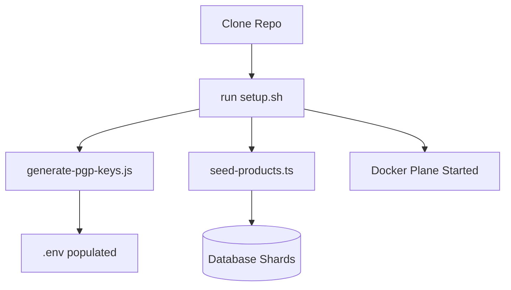

# 🛠️ Platform Scripts & Tooling

This section documents the utility scripts and extra tools used to manage, secure, and bootstrap the E-Commerce Microservices Platform.

## 🗝️ PGP Key Generation (`generate-pgp-keys.js`)

### Why do we use this?

In a zero-trust architecture, sensitive payloads (like payment details or private user data) should be encrypted even when traveling over internal networks. We use **OpenPGP** to provide:

1.  **Encryption**: Ensuring only the intended service can read the data.
2.  **Digital Signatures**: Verifying that the data was actually sent by the claimed source service.

### What it does:

- Generates a 2048-bit RSA key pair.
- Automatically formats and injects these keys into your `.env` file.
- Provides a consistent identity for the platform's internal communications.

---

## 🌱 Product Seeding (`scripts/seed-products.ts`)

### Why do we use this?

A microservices system is difficult to visualize without data. This script provides a production-like catalog to test:

1.  **Sharding Logic**: Distributed products across multiple database shards.
2.  **Search Performance**: Testing high-frequency reads against the Product Service.
3.  **UI/UX**: Providing realistic content for the frontend.

---

## 🏗️ Automated Setup (`setup.sh`)

### Why do we use this?

Microservices are complex to bootstrap. This script automates the developer experience by:

1.  **Prerequisite Checks**: Ensuring Docker, Node, and pnpm are ready.
2.  **Environment Sync**: Generating `.env` and PGP keys.
3.  **Build Orchestration**: Building all 11 shared libraries in the correct order.
4.  **Infrastructure Startup**: Spinning up the Docker Plane (Postgres, Redis, NATS).

---

## 🌊 Tooling Workflow

---

[⬅️ Back to Home](../../README.md)
