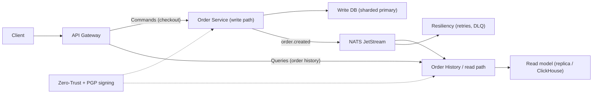

# 🌌 Advanced: Resilience & High Scale

The advanced phase focuses on making the platform highly performant and stable under load.

## 🎯 Learning Objectives

1.  **CQRS (Command Query Responsibility Segregation)**: Separating Write (Orders) from Read (Analytics/History).
2.  **Resiliency Patterns**: Implementing Circuit Breakers and Retries (see `resiliency-patterns.md`).
3.  **Security Engineering**: Zero-Trust architecture and PGP payload signing.
4.  **Database Sharding & Scaling**: Strategies for handling millions of users.

## 🛡️ Engineering for Failure

In a system this size, things _will_ fail. Advanced engineering is about **graceful degradation**.

### Why CQRS in this Project?

We use CQRS to ensure that a surge in users viewing their "Order History" (Queries) doesn't slow down the "Checkout" process (Commands).

### Diagram

---

[⬅️ Back to Roadmap](./engineering-roadmap.md)
