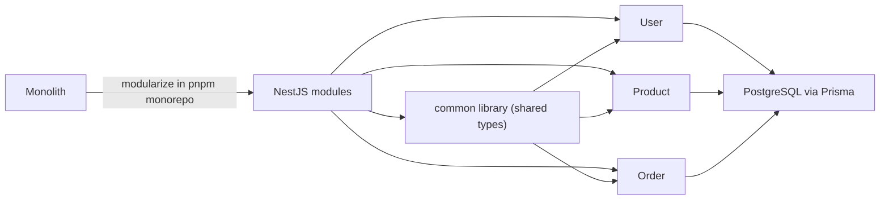

# 🌑 Beginner: From Monolith to Modules

In the context of this platform, the beginner phase is about understanding how business logic is organized before it becomes distributed.

## 🎯 Learning Objectives

1.  **Monorepo Structure**: Understanding how `pnpm workspaces` manage multiple packages in one place.
2.  **Domain Isolation**: Learning why `User`, `Product`, and `Order` are separate folders even if they feel like one app.
3.  **Basic NestJS**: Mastering Controllers, Services, and Providers.

## 🏗️ The Starting Point

Most developers start with a **Monolith**. In this repo, we simulate the "Modular" approach first.

### Why modularize first?

- **Ease of Development**: Faster to build and test.
- **Shared Types**: Using the `common` library across all modules.
- **Database Basics**: Understanding how Prisma interacts with PostgreSQL.

### Diagram

---

[➡️ Next: Intermediate Path](./intermediate.md) | [⬅️ Back to Roadmap](./engineering-roadmap.md)
