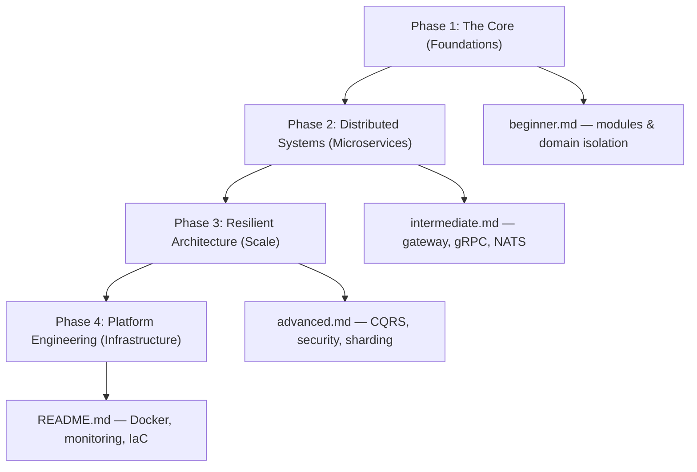

# �️ Engineering Roadmap

This roadmap guides you through the architectural layers of this repository, from modular logic to high-scale platform engineering.

---

## 🚀 The Project Trajectory

### 🌑 [Phase 1: The Core (Foundations)](./beginner.md)

- **Context**: Understanding the `apps/` and `libs/` monorepo structure.
- **Goal**: Mastering NestJS modules and domain isolation.

### 🚀 [Phase 2: Distributed Systems (Microservices)](./intermediate.md)

- **Context**: Implementing the `api-gateway`, gRPC communication, and NATS messaging.
- **Goal**: Moving from local function calls to distributed service orchestration.

### 🌌 [Phase 3: Resilient Architecture (Scale)](./advanced.md)

- **Context**: Using CQRS in the `order-service` and PGP security in the `auth-service`.
- **Goal**: Building a "Zero-Trust" system that handles massive read/write loads.

### 🔭 [Phase 4: Platform Engineering (Infrastructure)](../../README.md)

- **Context**: Dockerization, Prometheus monitoring, and automated `setup.sh` workflows.
- **Goal**: Managing the entire infrastructure as code.

### Diagram

---

[⬅️ Back to Home](../../README.md)
