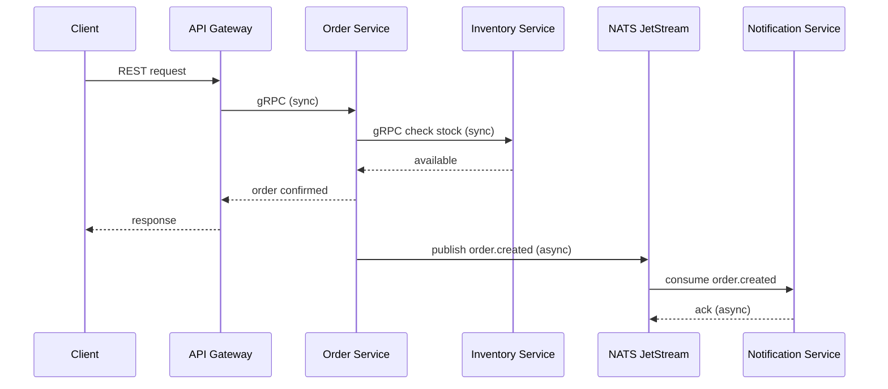

# 🚀 Intermediate: Distributed Systems

This phase moves from single-process logic into a distributed system.

## 🎯 Learning Objectives

1.  **API Gateway Pattern**: Using `api-gateway` as the entry point for all services.
2.  **Service-to-Service gRPC**: Low-latency synchronous communication (e.g., `Order` ↔ `Inventory`).
3.  **Event-Driven Pub/Sub**: Asynchronous messaging via NATS (e.g., `Order.created` → `Notification`).
4.  **Distributed Caching**: Using Redis in the `cart-service` for ephemeral session data.

## 🌉 Bridging the Gap

At this stage, you are no longer calling functions; you are calling **endpoints** and **services**.

### Key Concept: Synchronous vs Asynchronous

- **Sync (gRPC)**: "I need to know if we have stock _right now_."
- **Async (NATS)**: "The order is placed, someone needs to send an email _whenever possible_."

### Diagram

---

[➡️ Next: Advanced Path](./advanced.md) | [⬅️ Back to Roadmap](./engineering-roadmap.md)
