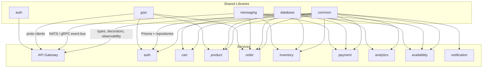

# 📚 Shared Libraries

To ensure consistency and DRY (Don't Repeat Yourself) principles, common logic is abstracted into shared libraries.

## 🧩 Who Uses What

## 🛠️ Library List

- **[Common Lib](./common-lib.md)** - Shared types, decorators, and utilities.
- **[Database Lib](./database-lib.md)** - Prisma abstractions and repository patterns.
- **[Messaging Lib](./messaging-lib.md)** - NATS and gRPC communication abstractions.

> The remaining libraries (`auth`, `cache`, `monitoring`, `security`, `testing`, ...) follow the same patterns and are documented within their `libs/<name>/README.md` and the service docs they support.

---

[⬅️ Back to Home](../../README.md)
