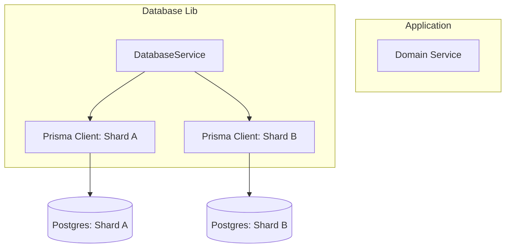

# 🗄️ Database Library (`libs/database`)

The Database Library provides a centralized, type-safe abstraction over **PostgreSQL** using **Prisma ORM**, specifically designed for a multi-service architecture.

---

## 🏗️ Core Responsibilities

- **Connection Management**: Handles connection pooling and lifecycle for Prisma clients.
- **Service Isolation**: Provides patterns to ensure services only access their own schema/shard.
- **Repository Pattern**: Implements standardized database access methods to keep domain logic clean.
- **Automated migrations**: Standardized workflow for schema evolution.

---

## 🗺️ Sharding Architecture

As documented in the [Scaling & Sharding Strategy](../infrastructure/scaling-and-sharding.md), this library supports multi-shard configurations.



---

## ⚡ Performance Features

1.  **Read Replicas**: Support for routing `find` operations to read-only replicas.
2.  **Connection Pooling**: Optimized for high-concurrency NestJS environments.
3.  **Middlewares**: Automated timestamping (`createdAt`, `updatedAt`) and soft-delete handling.

---

## 🛠️ Usage Example

```typescript
@Injectable()
export class OrderRepository {
  constructor(private readonly db: DatabaseService) {}

  async create(data: CreateOrderDto) {
    return this.db.order.create({ data });
  }
}
```

---

[⬅️ Back to Home](../../README.md)
