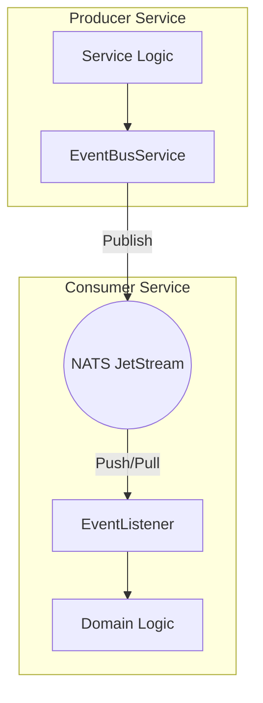

# 📚 Messaging Library (`libs/messaging`)

The Messaging Library is the backbone of the platform's distributed communication, providing abstractions over **NATS JetStream** and **gRPC**.

---

## 🏗️ Core Responsibilities

- **Abstraction**: Simplifies complex NATS JetStream pub/sub logic into a clean `EventBusService`.
- **Reliability**: Implements retry logic, acknowledgments, and dead-letter queue (DLQ) handling.
- **Contract Enforcement**: Ensures all events follow a consistent schema across services.
- **Performance**: Optimized gRPC client configurations for low-latency synchronous calls.

---

## 🛰️ Event Bus Architecture

We use **Choreography-based Sagas** for distributed processes. The `EventBusService` handles the publication and subscription of these events.



### Key Components:

1.  **EventBusService**: The main interface for publishing events to NATS subjects.
2.  **QueueService**: Abstraction for handling job queues and scheduled tasks.
3.  **Processors**: Standardized interfaces for processing incoming events (e.g., `notification.processor.ts`).

---

## 🔄 Lifecycle of an Event

1.  **Emission**: A service calls `eventBus.emit('subject.action', data)`.
2.  **Persistence**: NATS JetStream stores the message for reliability.
3.  **Distribution**: NATS delivers the message to all services subscribed to the subject.
4.  **Acknowledgment**: Once the consumer successfully processes the event, it sends an `ACK` to NATS.
5.  **Failure**: If processing fails, NATS retries based on the **Exponential Backoff** policy before moving to the **DLQ**.

---

## 🛠️ Usage Example

```typescript
// Publishing an event
await this.eventBus.emit('order.created', { orderId: '123', total: 99.99 });

// Subscribing to an event
@OnEvent('order.created')
handleOrderCreated(data: OrderCreatedDto) {
  // Processing logic
}
```

---

[⬅️ Back to Home](../../README.md)
