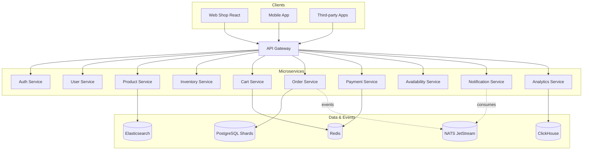

# 🧩 Service Catalog

Each service in this platform is a self-contained domain with its own responsibilities, data, and logic — designed to scale to **10M+ users**.

## 🗺️ System Overview

## 🚀 Core Services

- **[Web Shop (React Storefront)](../../apps/web-shop/README.md)** - The React 19 storefront: catalog, cart, checkout, account.
- **[API Gateway](../../apps/api-gateway/README.md)** - The central entry point and reverse proxy (`/api/v1/*`).
- **[Auth Service](../../apps/auth-service/README.md)** - Identity management and authentication.
- **[User Service](../../apps/user-service/README.md)** - User profile and preferences management.
- **[Product Service](../../apps/product-service/README.md)** - Product catalog, Elasticsearch search & recommendations.
- **[Inventory Service](../../apps/inventory-service/README.md)** - Real-time stock tracking and reservations.
- **[Cart Service](../../apps/cart-service/README.md)** - Shopping cart management (Redis-backed).
- **[Order Service](../../apps/order-service/README.md)** - Order lifecycle, saga orchestration, and tracking.
- **[Payment Service](../../apps/payment-service/README.md)** - Financial transactions and gateway integration.
- **[Availability Service](../../apps/availability-service/README.md)** - Pincode-level delivery SLA checks.
- **[Analytics Service](../../apps/analytics-service/README.md)** - Event tracking and business intelligence (ClickHouse).
- **[Notification Service](../../apps/notification-service/README.md)** - Multi-channel alerts (Email, SMS, Push).

## 🖼️ Storefront

| **Home / Banner**                  | **Product Details**                               | **Cart**                    | **Order Tracking**                            |
| :--------------------------------- | :------------------------------------------------ | :-------------------------- | :-------------------------------------------- |
|  |  |  |  |

---

[⬅️ Back to Home](../../README.md)
