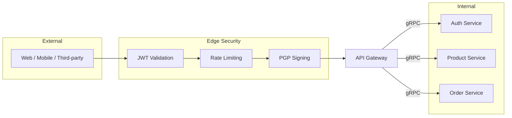

# 🚪 API Gateway

The **API Gateway** is the single entry point for all external traffic (Web, Mobile, Third-party) into the Skyline Shop ecosystem. It serves as an intelligent proxy and orchestrator.

## 🗺️ Request Flow

## 🛠️ Tech Stack

- **Framework**: NestJS
- **Communication**: REST (External) / gRPC (Internal)
- **Security**: JWT Validation, Rate Limiting, PGP Payload Signing

## 📋 Responsibilities

1. **Request Orchestration**: Aggregating data from multiple microservices into a single response.
2. **Edge Security**: Validating authentication tokens before forwarding requests.
3. **Load Balancing**: Distributing traffic to healthy service instances.
4. **API Versioning**: Managing lifecycle of public endpoints.

## 🔗 Internal Dependencies

- **[Auth Service](./auth-service.md)**: For session and identity validation.
- **[Order Service](./order-service.md)**: For checkout and history.
- **[Product Service](./product-service.md)**: For catalog browsing.

---

[⬅️ Back to Services Index](./README.md)
