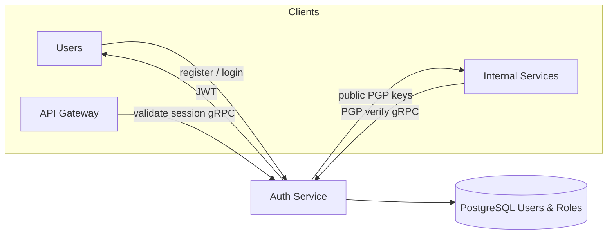

# 🔐 Auth Service

The **Auth Service** is the security backbone of the platform, managing identity, authentication, and internal service-to-service trust.

## 🗺️ Authentication Flow

## 🛠️ Tech Stack

- **Framework**: NestJS
- **Data Store**: PostgreSQL (Users & Roles)
- **Encryption**: bcrypt (Passwords), PGP (Service Signatures)

## 📋 Responsibilities

1. **Identity Management**: User registration, login, and profile management.
2. **Token Dispensation**: Issuing JWTs and managing refresh tokens.
3. **RBAC**: Enforcing Role-Based Access Control across the platform.
4. **PGP Key Management**: Distributing public keys for service-to-service verification.

---

[⬅️ Back to Services Index](./README.md)
