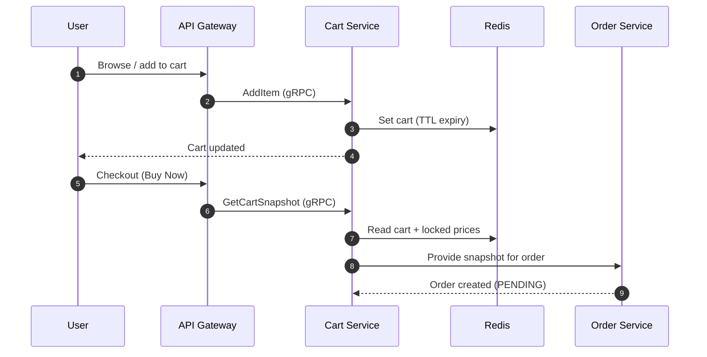

# 🛒 Cart Service

The **Cart Service** manages the highly volatile state of user shopping carts and active checkout sessions.

## 🗺️ Checkout Flow

## 🛠️ Tech Stack

- **Framework**: NestJS
- **Data Store**: Redis (for sub-millisecond persistence)
- **Protocol**: gRPC

## 📋 Responsibilities

1. **Cart Persistence**: Managing items, quantities, and expiration.
2. **Pricing Snapshots**: Locking in prices during the checkout window.
3. **Checkout Initiation**: Serving as the data source for the `Order Service` when a user clicks 'Buy'.

## ⚡ Performance Strategy

- **In-Memory Storage**: Uses Redis to handle high-frequency read/write operations without hitting the primary database.
- **Auto-Cleanup**: TTL-based expiration for abandoned carts.

---

[⬅️ Back to Services Index](./README.md)
